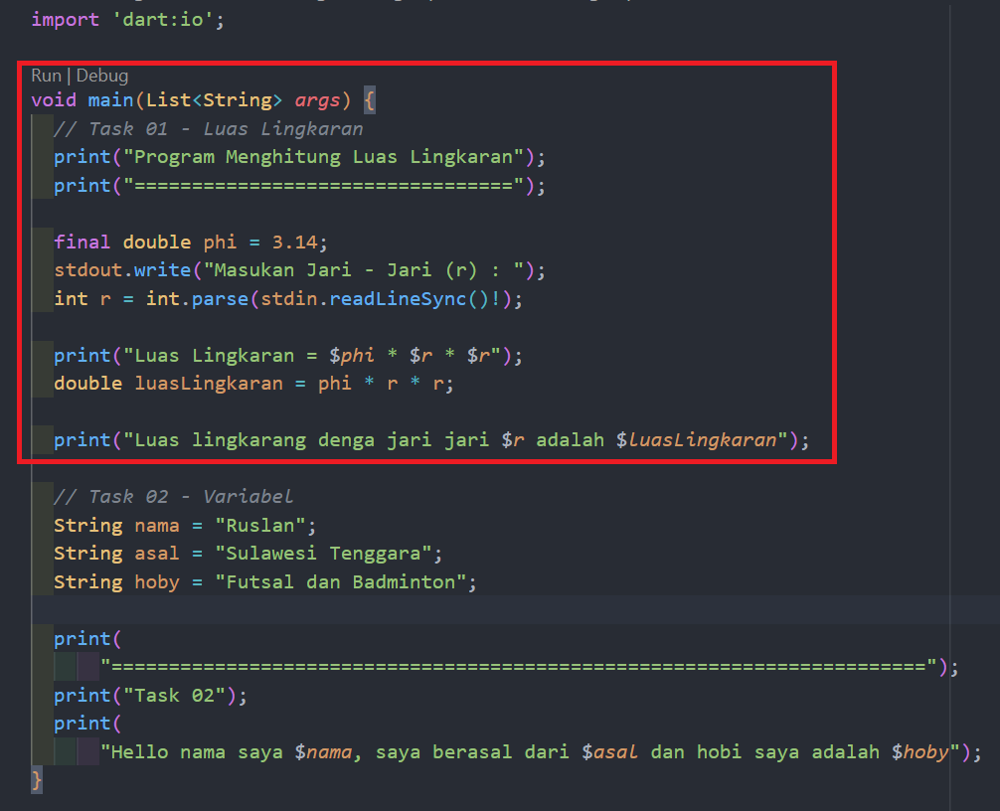
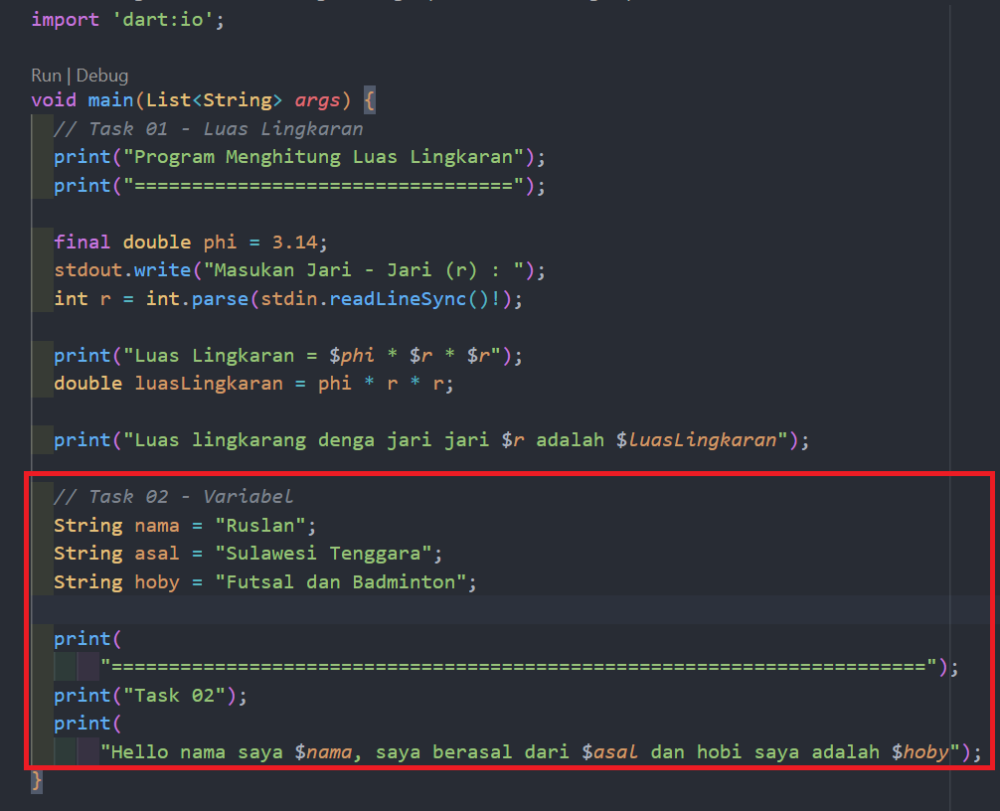

# (04) Introduction to Algorithm and Dart Programming

## Data Diri

Nomor Urut : 1_023FLB_52
Nama : Ruslan

## Summary

Di section ini saya belajar tentang Introduction to Algorithm and Dart Programming yang meliputi

- Pengenalan bahasa dart
  Dart adalah bahasa pemrograman yang dirancang untuk membuat aplikasi yang dapat berjalan lebih cepat, tujuan awal di buat dart adalah untuk menggantikan javascript yang dinilai masih memiliki banyak kekurangan.
  ***
- kelebihan dart

  - Type safe
    dart adalah bahasa pemrograman yang menjamin konsistensi pada tipe data
  - Null safety
    Dart merupakan bahasa pemrograman yang memberikan keamanan dari data yang bernilai null
  - Rich standart library
    Dart adalah bahasa pemrograman dengan dukungan library internal dan menjadi salah satu bahasa pemrograman yang memiliki library yang kompleks
  - multiplatform
    Dart adalah bahasa pemrograman yang mampu berjalan di bebrbagai jenis perangkat

---

- Dasar pemrrograman dart

  - Menampilkan text
    untuk menampilkan teks di konsol pada pemrograman dart menggunakan perintah print();
  - Komentar
    komentar bertujuan agar dapat memberikan catatan pada code dan mencegah perintah di jalankan. terdapat 2 cara untuk membuat komentar yang pertama adalah single line komentar dengan diawali dengan garis miring 2x (//) dan multi line komentar yang diawali dengan garis miring dan bintang dan diakhiri dengan tanda bintang dan garis miring (\*/)
  - variabel
    variabel adalah wadah untuk menyimpan data yang memiliki tipe data dan nama variabel. contoh penulisan variabel String nama = "Ruslan".
  - konstanta
    sama seperti variabel namun konstanta digunakan saat kondisi dimana nilai sebuah variabel bernilai tetap dan tidak dapat di ubah.

---

- Tipe data
  Tipe data adalah klasifikasi atau jenis data yang dapat di kelola. berikut jenis - jenis tipe data :

  - int => tipe data untuk mengelola bilangan bulat.
  - double => tipe data untuk mengelola bilangan pecahan.
  - bool => tipe data untuk mengelola kondisi (true/false)
  - string => tipe data untuk mengelola teks

---

- Operator
  operator digunakan untuk melakukan pengoperasian pada data. adapun jenis - jenis operator adalah sebagai berikut :
  - Operator arithmetic => operator untun melakukan perhitungan matematis
  - Operator assignment => operator untuk memberikan nilai pada variabel
  - Operator comparison => operator yang digunakan untuk membandingkan kesetaraan nilai
  - Operator logical => operator yang digunakan untuk menggabungkan beberapa kondisi

---

##Task
###Task 01
Membuat program menghitung luas lingkaran

pada program di atas terdiri dari 2 variebel yaitu variabel phi sebagai konstanta karena memiliki nilai mutlak dan varibel r (jari - jari) dimana nilai dari variabel r akan di ambil dari inputan.
Berikut output dari program diatas.

pada output di atas merupakan hasil dari luas lingkaran jika jari - jari nya bernilai 10.

###Task 02
Gabungan variabel

pada program di atas terdapat 3 variebel yang bertipe data string yaitu variabel nama, asal dan hoby.
Berikut adalah output dari program diatas.

output dari program tersebut adalah menampilkan text di consol dengan gabungan dari 3 variabel string tersebut
