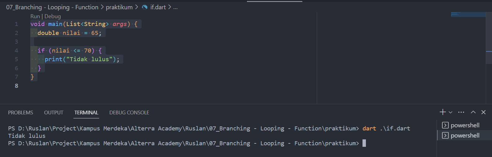
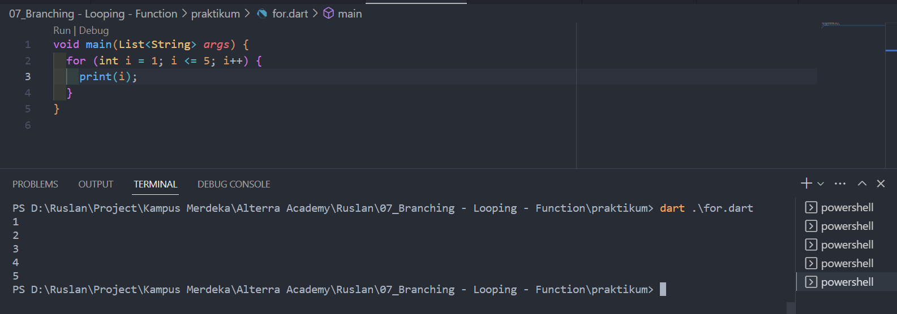
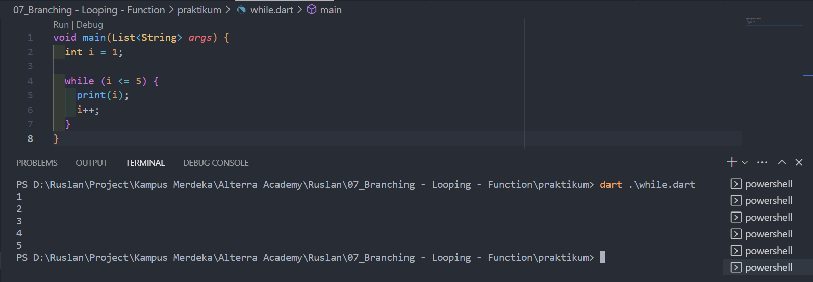
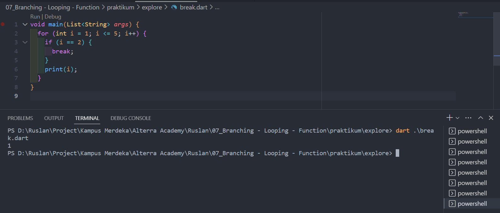
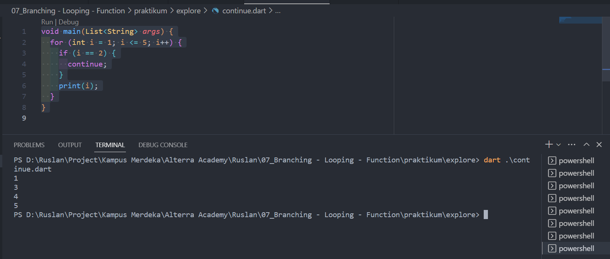
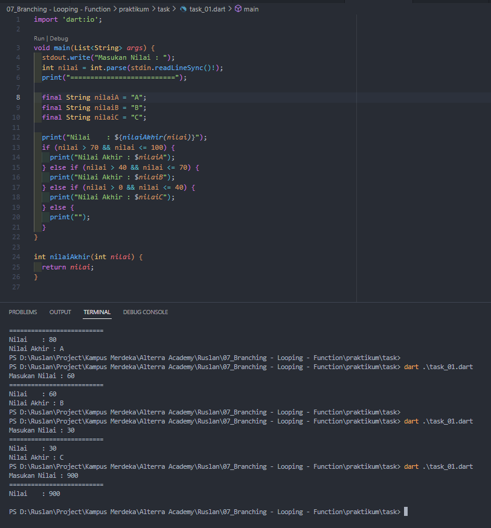
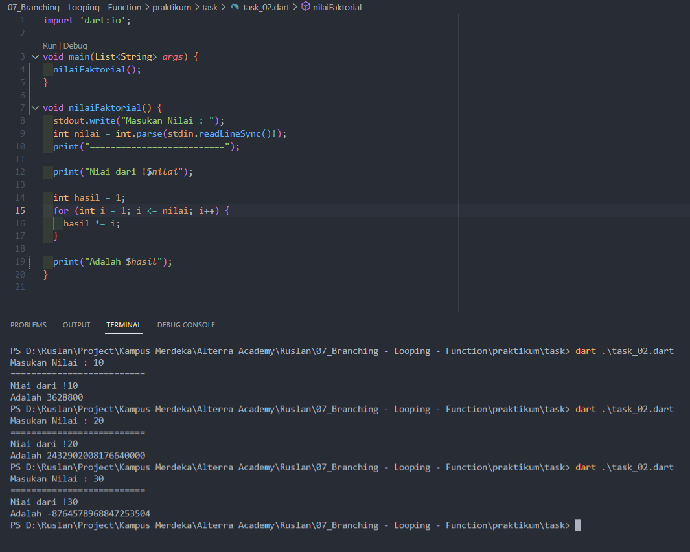

# (07) Branching - Looping - Function

## Data Diri

Nomor Urut : 1_023FLB_52
Nama : Ruslan

## Summary

Di section ini saya belajar tentang Branching - Looping - Function yang meliputi

- Pengkondisian
  Berikut beberapa Pengkondisian dari bahasa dart :

  - IF Statement
    Pada Pengkondisian if memerlukan nilai boolean dari operator logical atau comparison yang akan menjalankan proses jika nilai bool bernilai true. berikut contoh penulisan if :
    
    Pada code program diatas program akan menampilkan "Tidak Lulus" jika nilai dari variabel nilai kurang dari sama dengan 70.

  - Else statement
    Sama seperti if namun pada "else" akan menambahkan option jika nilai bool bernilai false. berikut contoh penulisan else :
    
    Pada code program diatas program akan menjalankan perintah if terlebih dahulu jika kondisi dari if tidak terpenuhi makan akan menjalankan perintah else.

  - Else If Statement
    Sama seperti if dan else namun pada "if else" akan menambahkan option jika nilai bool lainnya. berikut contoh penulisan if else :
    
    Pada code program diatas sama seperti else namun ada kondisi jika kedua statement if dan else if tidak terpenuhi akan menjalankan statement else.
    ***

- Perulangan
  Perulangan adalah sebuah kondisi dimana program akan dijalankan berulang kali. berikut beberapa contoh perulangan :

  - Perulangan For
    pada perulangan for memerlukan nilai awal dan juga memerlukan nilai boolean yang dimana jika nilai bool tersebut bernilai true maka akan melanjutkan ke proses selanjutnya selain itu juga memerlukan parameter pengubah nilai dan mengetahui proses perulangan akan berjalan berapa kali. untuk lebih jelas nya berikut contoh perulangan for :
    
    Pada program di atas memiliki variabel i dengan nilai awal 1 dan kondisi dimana akan terus melakukan perulangan sampai variabel i bernilai kurang dari sama dengan 5 atau saat variabel i bernilai 5 dan setiap kali melakukan pengecekan nilai i akan di tambahkan 1 dari nilai sebelumnya sehingga program tersebut menampilkan nilai 1 - 5.
  - While
    Pada perulangan while digunakan jika dalam kondisi tidak diketahui proses perulangan akan dilakukan berapa kali dan sama seperti perulangan for pada perulangan while juga memerlukan nilai bool yang dimana jika nilai bool tersebut bernilai true makan akan melanjutkan proses perulangan. berikut contoh perulangan while :
    
    pada program di atas sama seperti perulangan for dimana memiliki variabel i yang bernilai awal 1 dan melakukan pengecekan dimana jika kondisi kurang dari sama dengan 5 makan akan mencetak nilai i dan nilai i akan ditambahkan dengan 1 perulangan tersebut akan terus berjalan hingga nilai i sama dengan 5.
  - Do-While
    Pada perulangan Do-While proses akan dijalankan minimum sekali dan juga memiliki nilai bool yang dimana perulangan akan terus dilakukan jika nilai bool tersebut bernilai true. berikut contoh perulangan Do-while :
    
    Pada program di atas memliki variabel i dengan nilai awal 1 dan mencetak nilai i terlebih dahulu dan nilai i terbut akan ditambah 1 lalu melakukan pengecekan dimana kondisi dari pengecekan tersebut sampai nilai i akan <= 5 dan atau nilai i = 5.
    ***

- Break and continue
  Berikut perbedaan brak dan continue

  - break
    break akan menghentikan seluruh proses perulangan jika kondisi nya terpenuhi. berikut contoh break
    
    pada program di atas akan melakukan perulangan sebanyak 5 kali namun dengan kondisi jika nilai i = 2 maka perulangan akan di hentikan.
  - continue
    continue akan menghentikan satu kali proses perulangan jika kondisi nya terpenuhi. berikut contoh continue
    
    Pada program di atas sama seperti brak namun saat kondisi i bernilai 2 makan program tersebut akan lanjut melakukan pengecekan selanjutnya sehingga nilai dari kondisi tersebut tidak di proses atau di skip
    ***

- Fungsi / function
  fungsi berisi kumpulan perintah yang dapat digunakan berkali kali fungsi terdiri dari fungsi tanpa parameter, fungsi dengan parameter dan fungsi dengan return atau mengemnbalikan nilai.
  ***

##Task
###Task 01

Return Nilai

Berikut program mnentukan nilai akhir

Pada program di atas saya membuat sebuah fungsi nilai akhir yang bertipe data int yang dimana fungsi tersebut mengembalikan nilai dari inputan dari parameter fungsi tersebut. dan pada fungsi main saya membuat sebuah inputan nilai yang bertipe data int yang dimana nilai itu nantinya akan menjadi nilai parameter dari fungsi nilai akihir. di program tersebut juga saya membuat 3 variabel konstanta sebagai nilai akhirnya dan selanjutnya terdapat if statement yang dimana jika nilai yang di inputkan lebih besar dari 70 dan lebih kecil dari sama dengan 100 maka nilai akhir nya adalah A yang diambil dari varibel konstanta nilaiA, jika kondisi pertama tidak terpenuhi maka lanjut ke kondisi selanjutnya dimana jika nilai yang di inputkan lebih besar dari 40 dan lebih kecil dari sama dengan 70 maka nilai akhir adalah B yang diambil dari varibel konstanta nilaiB, jika kondisi kedua masih tidak terpenuhi maka selanjutnya adalah kondisi dimana jika nilai yang di inputkan lebih besar dari 0 dan lebih kecil dari sama dengan 40 maka nilai akhir adalah C yang diambil dari varibel konstanta nilaiC dan selain itu ada kondisi else yang akan menampilkan teks kosong

###Task 02

Program Faktorial

Berikut program mnentukan nilai akhir

Pada program di atas saya membuat sebuah fungsi untuk mencari nilai faktorial dimana fungsi tersebut betipe void. dalam fungsi tersebut saya mengambil nilai dari inputan yang disimpan dalam variabel nilai yang bertipe data int. selanjutnya saya membuat sebuah variabel hasil dimana nilai awal nya saya inisialisasi dengan nilai 1, selanjutnya akan melakukan perulangan dimana nilai awal dari perulangan tersebut adalah 1 yang disimpan dalam variabel i dan kondisi dimana perulangan akan terus terjadi ketika nilai i kurang dari sama dengan nilai yang di inputkan dan di setiap perulangan tersebut variabel hasil akan dikalikan dengan variabel hasil itu sendiri dan variabel i. selanjutnya adalah mencetak nilai dari hasil akhir
