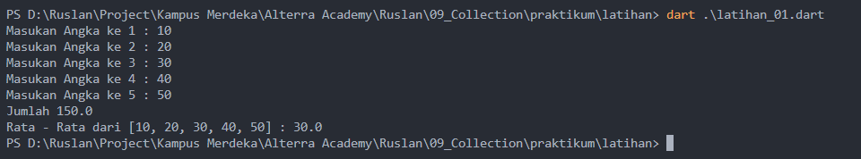
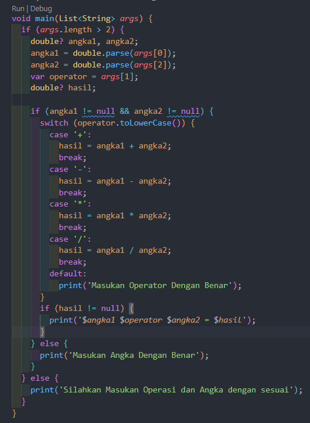

# (09) Collection

## Data Diri

Nomor Urut : 1_023FLB_52
Nama : Ruslan

## Summary

Di section ini saya belajar tentang Collection yang meliputi

- Pengenalan bahasa dart
  Dart adalah bahasa pemrograman yang dirancang untuk membuat aplikasi yang dapat berjalan lebih cepat, tujuan awal di buat dart adalah untuk menggantikan javascript yang dinilai masih memiliki banyak kekurangan.
  ***
- kelebihan dart

  - Type safe
    dart adalah bahasa pemrograman yang menjamin konsistensi pada tipe data
  - Null safety
    Dart merupakan bahasa pemrograman yang memberikan keamanan dari data yang bernilai null
  - Rich standart library
    Dart adalah bahasa pemrograman dengan dukungan library internal dan menjadi salah satu bahasa pemrograman yang memiliki library yang kompleks
  - multiplatform
    Dart adalah bahasa pemrograman yang mampu berjalan di bebrbagai jenis perangkat

---

- Dasar pemrrograman dart

  - Menampilkan text
    untuk menampilkan teks di konsol pada pemrograman dart menggunakan perintah print();
  - Komentar
    komentar bertujuan agar dapat memberikan catatan pada code dan mencegah perintah di jalankan. terdapat 2 cara untuk membuat komentar yang pertama adalah single line komentar dengan diawali dengan garis miring 2x (//) dan multi line komentar yang diawali dengan garis miring dan bintang dan diakhiri dengan tanda bintang dan garis miring (\*/)
  - variabel
    variabel adalah wadah untuk menyimpan data yang memiliki tipe data dan nama variabel. contoh penulisan variabel String nama = "Ruslan".
  - konstanta
    sama seperti variabel namun konstanta digunakan saat kondisi dimana nilai sebuah variabel bernilai tetap dan tidak dapat di ubah.

---

- Tipe data
  Tipe data adalah klasifikasi atau jenis data yang dapat di kelola. berikut jenis - jenis tipe data :

  - int => tipe data untuk mengelola bilangan bulat.
  - double => tipe data untuk mengelola bilangan pecahan.
  - bool => tipe data untuk mengelola kondisi (true/false)
  - string => tipe data untuk mengelola teks

---

- Operator
  operator digunakan untuk melakukan pengoperasian pada data. adapun jenis - jenis operator adalah sebagai berikut :
  - Operator arithmetic => operator untun melakukan perhitungan matematis
  - Operator assignment => operator untuk memberikan nilai pada variabel
  - Operator comparison => operator yang digunakan untuk membandingkan kesetaraan nilai
  - Operator logical => operator yang digunakan untuk menggabungkan beberapa kondisi

---

- Fungsi Lanjutan
  - Anonymous function
    Anonymous function atau lambda adalah function yang tidak memiliki nama
  - Arrow function
    Arrow function dapat memiliki nama dan tidak memiliki nama yang dimana nilai return dari function diambil dari data function tersebut. arrow fuction bertujuan untuk menuliskan function menjadi lebih ringkas

---

- Async-Await
  dengan menggunakan keyword sync-await dapat menjalankan beberapa proses secara Asynchronous tanpa menunggu proses lainnya selesai yang ditulis kedalam bentuk fungsi

---

- Tipe Data Future
  Future dapat membuat suatu proses berjalan nya fungsi bisa di beri waktu atau durasi. jika ingin mengembalikan data return dari objek future memerlukan keyword async untuk menjalankan proses karena async berjalan secara Asynchronous

---

- Collection
  - List
    List dapat menampung banyak data ke dalam satu objek. menyimpan bermacam-macam tipe data seperti string, number, dan boolean. contoh penulisan list
    - var numberList = [1, 2, 3, 4, 5];
    - var stringList = ['Hello', 'Dicoding', 'Dart'];
  - Set
    Set merupakan sebuah collection yang hanya dapat menyimpan nilai yang unik.
  - Map
    Ma adalah sebuah collection yang dapat menyimpan data dengan format key-value. Berikut contoh penulisan map:
    var capital = {
    'Jakarta': 'Indonesia',
    'London': 'England',
    'Tokyo': 'Japan'
    };

---

##Task
###Task 01
Penjumlahan List

Berikut code program task 01

pada kode program di atas saya membuat sebuah fungsi pengali dengan paramter List yang bertipe int dan sebuah parameter pengali dengan tipe int dan untuk fungsi tersebut saya buat secara asynchronous dengan tipe data Future dengan duration 3 second yang dimana hasil akhir dari hasil perkalian liat tersebut disimpan kedalam sebuah variabel list. dan ketika memanggil fungsi pengali pada fungsi main maka fungsi pengali akan diminta memasukan 2 parameter yakni parameter pertama list dan parameter kedua angka pengali. sebagai contoh saya memasukian list [1,2,3,4] dan bilangan pengali 2 sehingga hasilnya adalah sebuah list dengan nilai [2,4,6,8]

###Task 02
Membuat Collection List dan Map

Berikut kode program dari task 02

Secara umum program di atas saya membuat sebuah list ibu kota dan di dalam list ibu kota menampung nilai list juga yang dimana nantinya value dari dari list ibu kota tersebut akan di jadikan sebuah map. saya membuat sebuah menu untuk melakuakan pengecekan value dari list dan map yang dimana menu tersebut saya lakukan perulangan dengan kondisi variabel cek bernilai true maka akan terus belakukan perulangan menu. jika inputan nya 1 makan akan melakukan pengecekan value dari list yang dibuat sebelumnya dan jika inputanya 2 maka akan melakukan pengecekan nilai value dan key dari map yang di buat bedasarkan value dari list dan jika inputan nya 3 maka akan keluar dari program atau variabel cek nya bernilai false dan selain dari inputan 1 , 2, dan 3 maka akan memunculkan pesan "Masukan Angka Dengan Benar".

Berikut output dari program diatas.

##Latihan
###Latihan 01
Berikut kode program dari latihan 01
;

Pada program diaatas saya membuat sebuah program yang dimana nantinya akan terdapat 5 buah inputan yang dimana inputan tersebut nantinya akan dimasukan kedalam sebuah list dan hasil dari list tersebut akan di jumlah lalu dihitung rata - ratanya. pertama tama saya membuat variabel counter i dan j yang bernilai 0 dan rata2 untuk menampung nilai rata2, var listTotal untuk menampung nilai inputan yang disimpan kedalam list dan var hasil untuk menyimpan total dari list. untuk mengambil iputan saya mnggunakan sebuah perulangan while dengan kondisi var i yang bernilai 0 < 5 yang dimana akan melakukan looping sebanyak 5 kali untuk mengambil inputan yang dimana inputan tersebut akan disimpan kedalam sebuah variabel nilai dan nilai dari variabel nilai akan dimasukan kedalam list listTotal. untuk melakukan operasi penjumlahan saya juga menggunakan perulangan while yang dimana jika variabel j < panjang dari listTotal maka hasil akan ditambahkan dengan nilai setiap list yang ada. yang terakhir adalah mencetak jumlah dan rata rata dimana rata - rata diambil dari jumlah / panjang dari listTotal.

Berikut output dari program diatas

---

###Latihan 02
Berikut kode program dari latihan 02
;
Pada program diatas saya membuat sebuah list dengan matriks 5x4 yang dimana setiap list nya sudah diberikan nilai. pertama tama saya membuat sebuah variabel d nilai yang berupakan inisialisasi dari list angka, variabel jumlah untuk menghitung jumlah dari setiap baris nya, variabel rata2 untuk menyimpan nilai rata rata dari setiap baris nya dan juga variabel min dan max untuk menyimpan nilai maksimum dan minum nya.

setelah itu saya belakukan perulanngan dengan for in yang didalam perulangan tersebut terdapat operasi untuk melakukan penjumlahan dan mencari nilai rata - rata dengan rumus jumlah / panjang dari nilai dan lalu mencetak hasil penjumlahan dan rata rata selanjutnya adalah mencari nilai nilai minimum yang dimana variabel min saya isisialisasi nilai nya dengan jumlah karena nilai minimum tidak mungkin melebih dari jumlah. lalu melakukan perulangan dari setiap nilai dari matriks lalu melakukan pengecekan jika nilai dari setiap indeks lebh kecil dari nilai min yang diambil dari jumlah maka nilai min nya akan diganti dengan nilai indeks tersebut. begitupun dengan max saya inisialisasikan nilai nya dengan 0 dan jika nilai max yang bernilai 0 lebih kecil dari nilai setiap indeks nya maka akan digantikan dengan nilai dari indeks yang terbesar

Berikut hasil dari program diatas
;

---

###Latihan 03
Berikut kode program dari latihan 03
;
pada program diatas saya membuat 2 buah variabel nilai1 dan nilai2 untuk menyimpan parameter dengan ketentuan boleh bernilai null. yang dimana angka1 di set sebagai parameter indeks ke 0 dari list args dan angka2 di set sebagai parameter dari indeks ke 2 dari list args dan juga sebuah variabel operator yang di set sebagai parameter dari indeks ke 1 dari list args dan juga sebuah variabel hasil yang digunakan untuk menyimpan hasil operasi. pertawa program melakukan pengecekan dengan if yang dimana jika variabel angka1 dan angka2 tidak bernilai null maka akan dilakukan pengecekan ke step selanjutnya yakni mengecek apakah operator yang dimasukan sudah sesuai dengan ketentuan pada pengecekan ini saya menggunakan switch case, jika operator sudah sesuai (+, - ,\* ,/) maka program akan dijalankan sesuai operator yang dipilih dan jika operator yang dimasukan salah makan akan mencetak pesan "masukan operator dengan benar" dan selanjutnya jika hasil dari operasi tidak null atau sesuai makan akan mencetak hasil sesuai dengan operasi yang dijalankan. dan jika parameter angka dari variabel nilai1 dan nilai 2 tidak sesuai maka akan mencetak pesan "masukan angka dengaan benar".

Berikut hasil dari program diatas
;

---
