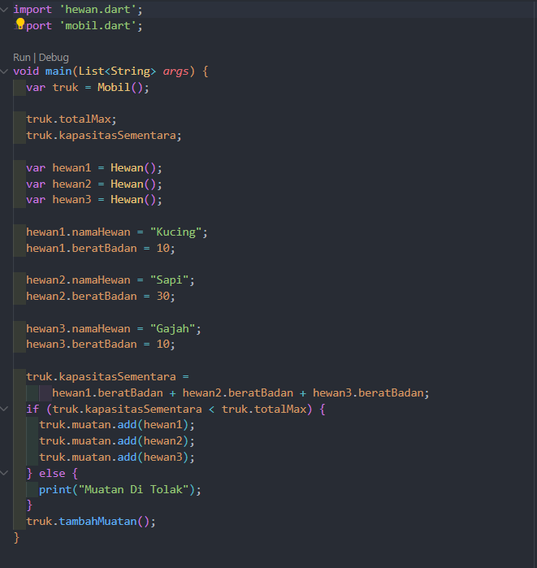
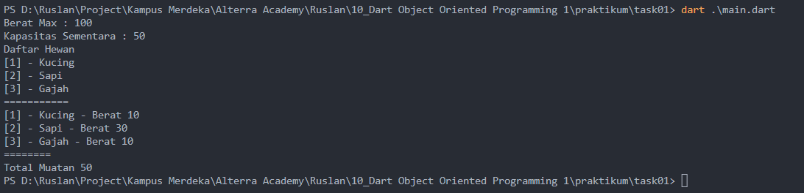

# (10) Dart Object Oriented Programming 1

## Data Diri

Nomor Urut : 1_023FLB_52
Nama : Ruslan

## Summary

Di section ini saya belajar tentang Dart Object Oriented Programming 1 yang meliputi :

- Objek Oriented Programming atau yang biasa di kenal sebagai OOP adalah sebuah program yang disusun dalam bentuk abstraksi objek yang dimana data dan proses diletakan pada abstraksi tersebut

---

- Ada bebebrapa keuntungan dalam menggunakan konsep paradigma OOP diantaranya adalah mudah melakukan troubleshoot jika terdapat error pada program serta mudah untuk digunakan ulang.

---

- Berikut beberapa komponen OOP diantaranya :

  - Class
    Class adalah sebuah abstraksi atau blueprint dari sebuah objek yang memiliki ciri ciri yang di sebut sebagai properti dan juga memiliki sifat dan kemampuan yang disebut sebagai method. Berikut contoh penulisan class :

    class Hewan {
    ......
    }

  - Objek
    Objek adalah bentuk sebenarnya dari sebuah class atau biasa disebut instance of class. berikut contoh penulisan objek dari class hewan diatas :

    void main() {
    var h1 = Hewan();
    var h2 = Hewan();
    var h3 = Hewan();
    }

  - Property
    Propery adalah ciri - ciri dari suatu class atau hal hal yang dimiliki suatu class dan memiliki sifat seperti variabel. Berikut contoh penulisan property pada class Sapi :

    class Hewan {
    var mata = 2;
    var kaki = 4;
    }

    Dan berikut conntoh dalam mengakses property :

    void main() {
    var h1 = Sapi();

        print(h1.mata);
        print(h1.kaki);

    }

  - Method
    Method adalah sifat dari suatu class atau aktivitas yang dapat dikerjakan suatu class dan memiliki sifat seperti fungsi. berikut contoh dalam membuat method pada class Kucing :

    class Kucing {
    void bersuara() {
    print("Meonggg..")
    }
    }

    Berikut cara pemanggilan method :

    void main() {
    var h1 = Kucing();
    h1.bersuara();
    }

  - Inheritance
  - Generics

---

##Task
###Task 01
Berikut code program dari task 01 :

- class hewan
  
  pada class hewan saya membuat 2 atribut yaitu nama hewan dengan tipe data String dan boleh null dan berat badan hewan yang bertipe data num

  ***

- class Mobil
  
  Pada class mobil saya membuat sebuah variabel berat maximum yang saya inisialisasi niai nya dengan 100 dan sebuah variabel kapasitas sementara yang saya inisialisasai nilai awal nya 0. dan sebuah list muatan yang diambil dari class hewan. dan sebuah method tambah muatan yang bertipe void yang dimana didalam method mencetak total muatan, kapasitas sementara dan list dari muatan yang diambil dari class hewan dengan atribut nama hewan

  ***

- class main
  
  pada class main pertama saya membuat objek truk direpresentasikan dari class Mobil dan memanggil total max dan kapasitas sementara dari class mobil. selanjutnya saya membuat 3 objek hewan dengan yaitu hewan 1, 2 dan 3 yang terdiri tadi nama hewan kucing dengan berat 10, sapi dengan berat 30 dan gajah dengan berat 10. lalu saya menghitung total sementara dengan menjumlah ketiga berat badan dari objek tersebut yang dimana saya memberikan kondisi jika kapasitas sementara lebih kecil dari total maksimum yaitu 100 dan jika kapasitas maksimum lebih kecil dari kapasitas sementara maka akan mencetak "Muatan Di tolak".

  ***

  Beriktu hasil dari program di atas
  

  Berikut hasil jika gajah saya ubah berat badan nya menjadi 100

  

###Task 02
Sama seperti task 01 namun di task 02 ditambahkan method totalMuatan.
Berikut code dari class mobil :

Pada method tambah muatan saya melakukan looping dari list muatan lalu membuat sebuah variabel totalMuatanMobil yang dimana variabel total muatan mobil nantinya ditambahkan dengan berat badan hewan yang terdapat di list muatan.

dan selanjutnya adalah memanggil method tersebut di class main

Berikut hasil nya :

