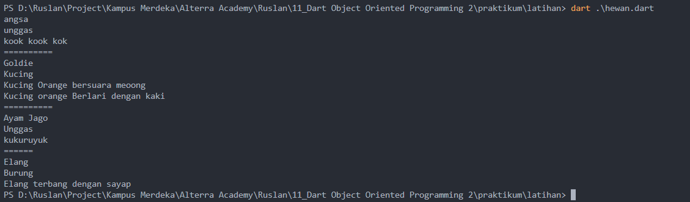

# (10) Dart Object Oriented Programming 2

## Data Diri

Nomor Urut : 1_023FLB_52
Nama : Ruslan

## Summary

Di section ini saya belajar tentang Dart Object Oriented Programming 2 yang meliputi :

- constructor digunakan untuk menkonstruksi objek baru dan constructor merupakan funsi atau method yang dijalankan saat pembuatan objek, sama seperti method constructor juga dapat menerima parameter namun constructor tidak memiliki return value. suatu constructor juga akan memiliki nama yang sama dengan nama class nya

---

- inheritance
  inheritance atau pewarisan adalah membuat class baru dengan memanfaatkan class yang sudah ada, inheritance bisa dianalogikan seperti seorang anak yang mewariskan sifat seperti orang tuanya dimana yang diwarisi bisa di sebut sebagai class anak atau class child dan yang menurunkannya di sebut sebagai class induk atau class parent yang bertujuan agar kemapuan yang dimiliki class parent dapat dimiliki oleh class child nya. untuk melakukan inheritance atau pewarisan bisa dengan menggunakan keyword extends saat pembuatan class child

---

- method overriding adalah kemampuan menulis ulang method yang sudah ada pada super-class nya atau class induk nya yang bertujuan untuk agar method child nya memiliki method yang sama namun dengan proses yang berbeda. saat melakukan overriding ada beberapa hal yang dapat dilakukan : - overriding dilakukan pada class yang melakukan inheritance - menggunakan method yang sudah ada palda class parent - menulis ulang seperti membuat method baru pada class child - menambahkan tanda @oberride dibaris sebelum method dibuat

---

- Interface adalah _class_ yang menunjukan method apa saja yang ada pada suatu class dan slurh method yang ada wajib di override, interface dapat digunakan dengan kata kunci implements. saat menggunakan interface sekilas mirip dengan inheritance namun pada class yang melakukan implements wajob melakukan override pada semua method yang ada pada class induk nya

- Abstrak class meruapakan class abstrak yang artinya class ini hanya gambaran umum dari sebuah class dan tidak dapat dibuat _pada suatu class secara langsung_ namun dapat menurunkan semua properti dan method method yang dimiliki class abstrak tersebut dan semua method tidak harus di override

- Polymorphism adalah kemapuan sebuah data objek berubah menjadi bentuk lain, tipe data yang dapat digunakan adalah super class dan dapat dilakukan pada class dengan melakukan extends ataupun implements

- Generics adalah memapuan menambahkan parameter tye pada class atau fungsi dan memberikan kemampuan agar dapar menerima data dengan type yang berbeda atau tipe data yang kita inginkan, tipe data tersebut ditentukan saat membuat class atau saat menjalankan fungsi

##Task
###Task 01
####Bangun Ruang

Berikut code program dari mencari volume dari bangun ruang :

- class bangun ruang
  

  Pada class bangun ruang saya membuat variabel panjang, lebar, tinggi dan sisi dan juga membuat sebuah construtor dari bangun ruang. dan sebuah method volume untuk mencari nilai volume dimana nilai volume adalah hasil kali dari paramter dimana parameter diambil dari inputan parameter 1, 2 dan 3.

- class Balok
  

  Pada class balok saya membuat sebuah konstructor dari bangun ruang dengan parameter panjang, lebar, tinggi dan sisi dan memanggil methon volume yang ada di class bangun ruang dengan cara override yang dimana paramert nya adalah panjang, lebar dan tinggi

- class Kubus
  

  Pada class kubus saya juga membuat sebuah contructor dari Kubus dengan parameter panjang, lebar, tinggi dan sisi dan sebuah variabel sisi untuk menyimpan nilai sisi nya dan juga memanggil method volume dengan paraeter sisi1, sisi2 dan sisi3

- class main
  
  Pada class main saya membuat sebuah menu diaman jika pengguna menginputkan angka 1 maka akan memanggil class balok dengan objek bangun dengan parameter pertama panjang, paramter kedua lebar, parameter ketiga tinggi dan parameter keempat sisi. berhubung balok tidak memlikiki sisi maka nilai sisi nya di isi 0. kemudian mencetak nilai panjang, lebar dan tinggi dan juga mencetak volume dengan paramter panjang, lebar dan tinggi dan mencetak volume dari balok, jika yang di inputkan angka 2 maka akan memanggil class kubus dengan objek bangun dengan parameter pertama panjang, paramter kedua lebar, parameter ketiga tinggi dan parameter keempat sisi dan berhubung kubus hanya memiliki sisi maka parameter dari panjang, lebar dan tinggi di isi 0 dan jika yang di inputkan adalah angka 3 maka keluar dari perulangan dan selain dari angka 1, 2 dan 3 maka akan mencetak masukan data dengan benar.
- Berikut output dari program diatas
  

##Task
###Task 01
####KPK dan FPB

Berikut code program dari KPK dan FPB :

- class matematika

##Latihan
###Latihan 01 (Hewan)
Berikut kode program :

- class hewan
  
  pada class hewan saya membuat 2 variabel nama hewan dan jenis hewan yang bertipe string dan boleh null dan sebuah constructor hewan dengan parameter nama hewan dan jenis hewan dan sebuah method bersuara dengan parameter suara
- class kucing
  
  pada class kucing saya membuat sebuah kontructor kucing dengan parameter nama hewan dan jenis hewan yang mengextends dari class hewan dan sebuah method berlari dengan parameter inputan berlari
- class unggas
  
  pada class unggas saya membuat sebuah variabel keluarga dan contructor dari unggas dengan paramter nama hewan dan jenis hewan yang di extends dari class hewan
- class burung
  
  pada class burung saya melakukan extends ke class unggas dan membuat contructor burung dengan parameter nama hewan dan jenishewan dan sebuah method terbang dengan parameter inputan terbang
- class main
  

  - pada class main saya membuat objek hewan 1 dari class hewan dengan paramert nama hewan angsa dan jenis hewan nya unggas, lalu mencetak nama hewan dan jenis hewan dari objek hewan 1 dan juga memanggil method bersuara dengan parameter "koook kok kok".

  - selanjutnya saya membuat objek kucing orange dari class kucing dengan parameter nama hewan "goldie" dan jenis hewan "kucing" lalu mencetak nama hewan, jenis hewan, dan memanggil method bersuaran dan lari.

  - selanjutnya saya membuat sebuah objek ayam dari class unggas dengan parameter nama hewan "ayam jago" dan jenis hewan "unggas" kemudian mencetak nama dan jenis hewan dan juga memanggail method bersuaran dan juga properti kluarga.

  - yang terakhir saya membuat sebuah objek elang dari class burung dengan parameter nama hewan "elang" dan jenis hewan "burung" kemudian mencetak nama dan jenis hewan dan mmanggil method terbang dan properti keluagra.

  - Berikut hasil dari program diaatas

  
