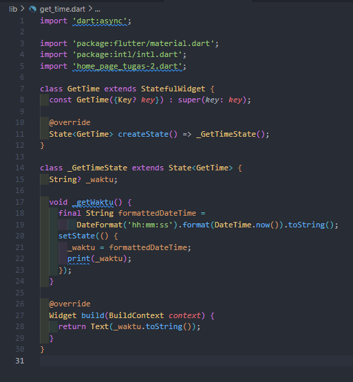

# (12) Introduction Flutter Widget

## Data Diri

Nomor Urut : 1_023FLB_52
Nama : Ruslan

## Summary

Di section ini saya belajar tentang Introduction Flutter Widget yang meliputi :

- flutter marupakan tools atau alat pengembangan antarmuka pengguna dari google yang digunakan untuk membuat aplikasi mobile dekstop dan web.
- keunggulan flutter

  - mudah digunakan dan dipelajari
  - produktivitas tinggi
  - dokumentasi lengkap
  - komunitas yang berkembang

- Bagian dari flutter
  flutter terdiri dari software developemt kit atau sdk yang merupakan alat - alat atau tools yang membantu dalam pengembangan aplikasi. di dalam sdk terdapat framework.

- widget digunakan untuk membentuk antarmuka atau UI dari aplikasi yang akan dibuat yang merupakan class atau blueprint dan dapat terdiri dari beberapa widget lainnya. widget terdiri dari 2 jenis yaitu stateless dan statefull :

  - Stateless widget
    satteless widget adalah widget yang tidak bergantung pada perubahan data dan hanya fokus pada tamppilan atau ui dari aplikasi dan dibuat dengan extends class StatelessWidget
  - Statefull Widget
    Statefull widget adalah widget yang mementingkan perubahan data dan dibuat denga extends class StaefulWidget dan terdiri dari 2 class yaitu widget dan state
  - Build in widget
    build in widget adalah widget yang dapat langsung digunakan dan umumnya sudah terinstall di flutter. berikut beberapa contohh build in widget di flutter :
  - Material App
    Materiall App adalah widget yang digunakan untuk membangun aplikasi dengan desail material dengan widgdet material app kita dapat manggil widget widget lainna yang ada di dalam material desain dari flutter
  - Scaffold
    scaffold adalah widget yang diguakan mementuk sebuah halaman aplikasi yang biasanya terdirid dari app bar dan body
  - App Bar
    App bar adalah widget yang digunakan untuk membentuk app bar atau application bar yang terletak di bagian atas halaman
  - text adalah wifget untuk menampilkan teks

##Task
###Task 01

Pada task kali ini saya menggunakan librarty intl dari flutter, berikut link dari library tersebut : https://pub.dev/packages/intl/install

Setelah melakukan install ibrarry diatas selanjutnya setelah berhasil di install maka akan membentuk sebuah dependencies dari int tersebut, berikut contoh dependencies nya

Berikut code dari task 01 :

- Home Page
  

  - Pertama tama saya melakukan inport async, material dart dan librarry intl.
  - Selanjutnya adalah mebuat state widget dengan stateful widget dengan nama MyApp
  - Setelah membuat sebuah variabel untuk string untuk melakukan increment dari second
  - setelah itu memanggil sebuah method dari initstate dengan memanggil memanggil widget Timer dari material dengan callback function \_getWaktu
  - selanjutnya membuat function -getWaktu yang diamana di dalam function tersebut mmengambil waktu saat ini dan ditampilkan
  - selanjutnya adalah membuat tampilan atau UI dengan materiall App dengan home widget scaffold dan menambahkan app bar dan body dimana body menggunakan widget center agar berada di tengah lalu menampilkan variabel \_waktu dengan font size 32 dan dengan tulisan bold

- class main
  
  selanjutnya adalah manggil class MyApp dengan melakukan import dari file tugas01.dart selain import tugas01 harus melakukan import material, async dan librarry intl

- Berikut hasil dari code program diatas
  

###Task 02
Sama seperti task 01 namun pada task 2 saya melakukan pemecahan dari beberapa widget

- Class Get Time
    
  Yang pertama adalah mengimport material, async, intl dan task02 lalu membuat class GetTime dengan statefull widget dan membuat sebuah function \_getWaktu yang dimana didalam function tersebut mengambil dari waktu saat ini dan pada mereturn text waktu saat ini yang akan di tampilkan ke halaman home

- Home Page
  
  Pada home page sama seperti sebelum sebelumnya pertama tama adalah melakukan import material, async, intl dan juga mengimport get time lalu membuat sebuah stateful widget dengan menggunakan widget MaterialApp dengan home scaffold dan membuat sebuah appbar dan membuat body dengan widget center dengan child adalah GetTime dari dari class get time.

- Main Page
  
  Selanjutnya pada main page melakuakn tambahan import file home page task 02 dan memanggil function MyApp di file home page task 02

- Berikut output dari task diaas
  
