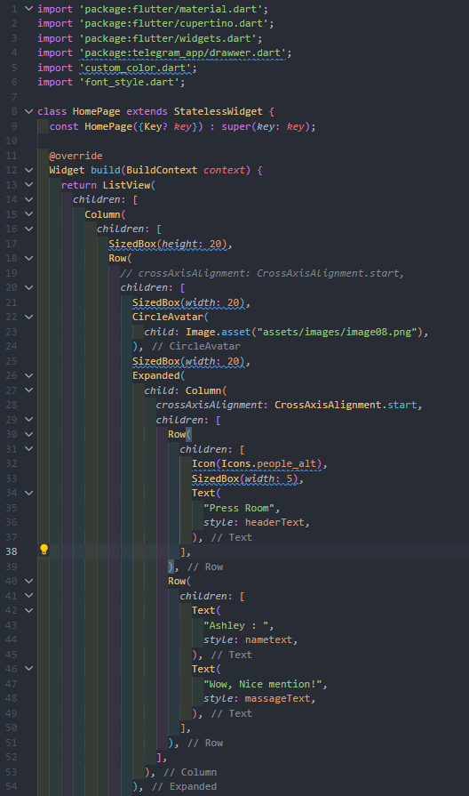

# (13) Platform Widget

## Data Diri

Nomor Urut : 1_023FLB_52
Nama : Ruslan

## Summary

Di section ini saya belajar tentang Platform Widget yang meliputi :

- MaterialApp
  MaterialApp adalah sebuah widget yang mengemas seluruh widget dalam aplikasi yang digunakan pada sistem android dengan cara mengimport package dari material.dart. adapun struktur dari material app adalah widget yang pertama kali dibuka akan diletakan pda bagian home

- Scaffold
  Scaffold adalah widget dasar untuk membangun sebuah halaman pada MaterialApp yang terdiri dari appbar, body dan bottom navigation.

- CupertinoApp
  CopertinoApp adalah sebuah widget yang mengemas seluruh widget dalam aplikasi yang digunakan pada sistem ios dengan cara mengimport package dari cupertino.dart, sama seperti materialApp widget yang pertama kali dibuka akan diletakan pda bagian home

- CupertinoPageScaffold
  Sama seperti scaffold pada sistem android, CupertinoPageScaffold juga adalah widget dasar untuk membangun sebuah halaman pada CupertinoApp yang terdiri dari navigation bar dan child

##Task
###Task 01
Berikut code program dari task 01 :

- Custom Color
  

  Pada file custom color saya mendekalrasikan semua warna yang akan saya gunakan

- Custom Font
  
  Di file custom font saya medeklarasikan style font yang akan saya gunakan mulai dari warna, ukuran dll

- Drawer
  
  
  pada Drawer saya membuat sebuah stack dengan memasukan gamber lalu membuat menu dengan icon dan text dengan menggunakan widget colum dan row

- Home Page
  
  
  
  
  
  

  Pada home page saya membuat data statis dengan memasukan satu per satu data yang dibutuhkan

- Main Page
  
  Pada halaman main berisi app bar dengna sebuah drawer yang diambil dari file drawer dan juga icon button search dan pada body saya memanggil home page

- Hasil
  Berikut hasil dari program diatas
  
  
