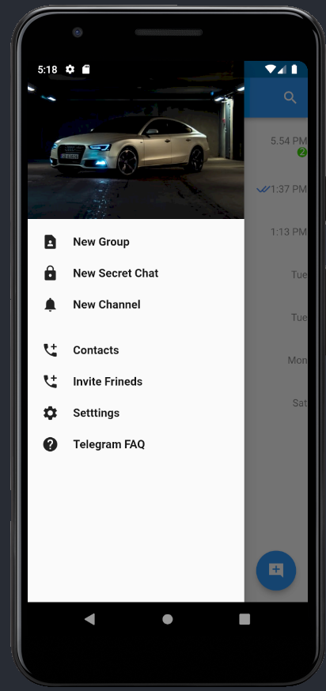

# (13) Platform Widget

## Data Diri

Nomor Urut : 1_023FLB_52
Nama : Ruslan

## Summary

Di section ini saya belajar tentang Platform Widget yang meliputi :

- MaterialApp
  MaterialApp adalah sebuah widget yang mengemas seluruh widget dalam aplikasi yang digunakan pada sistem android dengan cara mengimport package dari material.dart. adapun struktur dari material app adalah widget yang pertama kali dibuka akan diletakan pda bagian home

- Scaffold
  Scaffold adalah widget dasar untuk membangun sebuah halaman pada MaterialApp yang terdiri dari appbar, body dan bottom navigation.

- CupertinoApp
  CopertinoApp adalah sebuah widget yang mengemas seluruh widget dalam aplikasi yang digunakan pada sistem ios dengan cara mengimport package dari cupertino.dart, sama seperti materialApp widget yang pertama kali dibuka akan diletakan pda bagian home

- CupertinoPageScaffold
  Sama seperti scaffold pada sistem android, CupertinoPageScaffold juga adalah widget dasar untuk membangun sebuah halaman pada CupertinoApp yang terdiri dari navigation bar dan child

##Task
###Task 01
Berikut code program dari task 01 :

- Custom Color
  

  Pada file custom color saya mendekalrasikan semua warna yang akan saya gunakan

- Custom Font
  
  Di file custom font saya medeklarasikan style font yang akan saya gunakan mulai dari warna, ukuran dll

- Drawer
  
  
  pada Drawer saya membuat sebuah stack dengan memasukan gamber lalu membuat menu dengan icon dan text dengan menggunakan widget colum dan row

###

- Home Page
  
  
  
  
  
  

  Pada home page saya membuat data statis dengan memasukan satu per satu data yang dibutuhkan

- Main Page
  
  Pada halaman main berisi app bar dengna sebuah drawer yang diambil dari file drawer dan juga icon button search dan pada body saya memanggil home page

- Hasil
  Berikut hasil dari program diatas
  
  

###Task 01 Cupertino (Remedial)
####Telegram Apss dengan Cupertino Desain

- Model (messege.dart)

```
class Message {
  String profile;
  String nama;
  String pesan;
  String waktu;

  Message({
    required this.profile,
    required this.nama,
    required this.pesan,
    required this.waktu,
  });
}
```

Pada model messege saya membuat 4 yang bertipe string variabel yaitu profile, nama, pesan dan waktu dan juga saya membuat constructor dari kelas tersebut

- List Messege (lsit_messege.dart)

```
class ListMessege extends StatelessWidget {
  final List<Message> data;
  const ListMessege(this.data, {super.key});

  @override
  Widget build(BuildContext context) {
    return ListView.builder(
      itemBuilder: ((context, index) => CupertinoListTile(
            leading: CircleAvatar(
              radius: 100.0,
              backgroundImage: AssetImage(data[index].profile),
            ),
            title: Text(data[index].nama),
            subtitle: Text(data[index].pesan),
            trailing: Wrap(spacing: 8, children: <Widget>[
              (Text(
                data[index].waktu,
                style: const TextStyle(fontSize: 8),
              )),
              const Icon(
                Icons.circle,
                color: Color.fromARGB(255, 54, 169, 245),
              )
            ]),
          )),
      itemCount: data.length,
    );
  }
}
```

Pada file list messege ini saya membuat sebuah variabel List dengan namadata yang diambil dari model Messege dan pada widget state ini saya mereturn sebuah listview builder denngan item builder CupertinoListTile dengna leading Widget CircleAvatar dengan radius 100 dan dengan image data index dara drari profile profile, kemudian pada title mengambil nilai dari index nama, kemudian pada subtitle mengambil nilai dari index pesan dan saya juga membuat sebuah trailing dengan wrap text dari index waktu dan icon sircle berwarna biru.

- Home Page (home_page.dart)

```
final chat = <Message>[
    Message(
        profile: "assets/images/factory.png",
        nama: 'Jingga',
        pesan: 'Are u ok ?',
        waktu: '9:43 PM'),
    ...
    Message(
        profile: "assets/images/image10.png",
        nama: 'Jayadi',
        pesan: 'Why ? ',
        waktu: 'Tue'),
  ];
```

Pada Home page pertama tama saya membuat sebuah variabel dengan nama chat yang berisi list dari model Messege

```
return CupertinoPageScaffold(
      navigationBar: const CupertinoNavigationBar(
        middle: Text('Chats'),
        trailing: Icon(CupertinoIcons.pencil_ellipsis_rectangle),
        leading: Padding(
          padding: EdgeInsets.only(top: 10),
          child: Text(
            'Edit',
            style: TextStyle(color: Color.fromARGB(255, 99, 173, 197)),
          ),
        ),
      ),
      ...
    );
```

Pada home page saya mereturn cupertino scaffold dengan cupertinoNavigationbar dengan middle text chasts yang berada di tengah dengan icon pencil sebagai trailing dan dengan text edit sebagai leading.

```
child: CupertinoTabScaffold(
  tabBar: CupertinoTabBar(
    items: const [
      BottomNavigationBarItem(
          icon: Icon(
            CupertinoIcons.person,
          ),
          label: 'Contacs'),
      BottomNavigationBarItem(
          icon: Icon(
            CupertinoIcons.phone,
          ),
          label: 'Calls'),
      BottomNavigationBarItem(
          icon: Icon(
            CupertinoIcons.chat_bubble_2,
          ),
          label: 'Chats'),
      BottomNavigationBarItem(
          icon: Icon(
            CupertinoIcons.settings,
          ),
          label: 'Settings'),
    ],
  ),
  tabBuilder: (context, index) {
    return CupertinoTabView(
      builder: (context) => pageContent[index],
    );
  },
),
```

Dan pada bagian child saya membuat CupertinoTabScaffold yang berisi toolbar BottomNavigationBarItem yang nantinya posisi nav bar nya berada di bawah dengan dengan item icon dari person, phone, chat, dan setting yang diambil dari cupertino icons.

```
Widget build(BuildContext context) {
    final pageContent = [
      const Center(
        child: Text('Contacs'),
      ),
      const Center(
        child: Text('Recently Calls'),
      ),
      ListMessege(chat),
      const Center(
        child: Text('Settings'),
      ),
    ];
    ...
  }
```

Pada bagian build saya membuat sebuah variabel dengan nama pageContent yang menampung nilai dari BottomNavigationBarItem yang dibuat sebelumnya dimana pada index pertama berisi text contact, pada index ke 2 berisi text Recently Calls dan pada index ke 3 berisi ListMassage yang diambil dari lisr chat dan index terakhir berisi text settings yang berada di tengah.

- Hasil
  Berikut hasil dari code diatas
  
  
  
  
