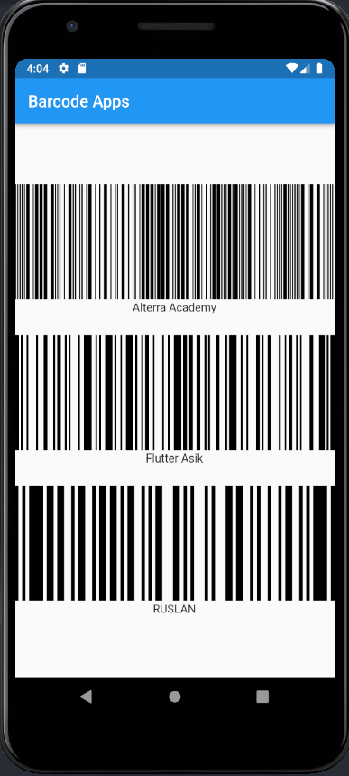

# (14) Flutter Command Line Interface (CLI) and Flutter package management

## Data Diri

Nomor Urut : 1_023FLB_52
Nama : Ruslan

## Summary

Di section ini saya belajar tentang Flutter Command Line Interface (CLI) and Flutter package management yang meliputi :

- Flutter CLI
  Flutter CLI atau comand line interface merupakan alat yanng bisa digunakan untuk berinteraksi dengan flutter sdk yang terdiri dari perintah yang dijalankan di dalam terminal untuk melakukan suatu tugas tertentu. berikut beberapa CLI command yang bisa digunakan dalam flutter :

  - Flutter Doctor
    Command flutter doctor merupakan perintah untuk menampilkan informasi software yang dibutuhkan flutter.

  - Flutter Create
    Command flutter create digunakan untuk membuat project aplikasi flutter baru di directory tertentu.

  - Flutter Run
    Command flutter run merupakan perintah untuk menjalankan project aplikasi di device yang tersedia.

  - Flutter Emulator
    Command flutter emulator merupakan perintah untuk menampilkan daftar emulatir yang terinstall dengan menampilkan option untuk membuka emulator atau membuat emulator baru. berikut contoh command nya :

    - flutter emulators => menampilkan daftar emulator
    - flutter emulators --launch ${emulator id} => menjalankan emulator
    - flutter emulators --create ${nama emulatir} => membuat amulator

  - Flutter Channel
    Command flutter chanel merupakan perintah untuk menampilkan daftar flutter channel yang tersedia dan menunjukan channel yang digunakan saat ini.

  - Flutter Pub
    Pada flutter pub terdapat 2 sintaks yang bisa digunakan yaitu :

    - flutter pub add => menambahkan packages ke dependencies yang ada di pubspec.yaml dengan command "flutter pub add ${package name}".
    - flutter pub get => untuk mendownload semua packages atau dependecies yang ada di pubspec.yaml

  - Flutter Build
    Command flutter build digunakan untuk meproduksi sebuah file aplikasi untuk keperluan deploy atau publish ke AppStore, PlayStore dll.

  - Flutter Clean
    Command flutter clean digunakan untuk menghapus build serta file lainnya yang yang dihasilkan saat menjalankan aplikasi di emulator yang akan memperkecil ukuran project aplikasi.

---

- Package Management
  Flutter merupakan framework yang mendukung sharring packages yang merupakan konstribusi dari developer lainnya dengan tujuan untuk mempercepat pengembangan aplikasi karena kita tidak perlu membuat semuanya dari awal dan untuk medapatkan packages dari flutter bisa menggunakan website pub.dev

---

- Cara Meambahkan Packages
  - Mencari package yang ingin digunakan di pub.dev
  - Copy baris dependecies yang ada di bagian installing
  - Buka pubspec.yaml
  - Paste baris dibawah dependencies pubspec.yaml
  - Run command flutter pub get di terminal
  - import package di file dart agar bisa digunakan
  - Stop atau restart aplikasi yang dibutuhkan

---

##Task
###Task 01 (Badges Apps)

Berikut code program dari badges apps :

- Dependencies
  
  Pertama tama saya menginstall packages badge dari pub.dev kedalam project di pubspec.yaml bagian dependencies.

---

- Class Main
  
  Pada class main pertama tama saya melakukan import flutter material seperti biasa dan memanggil packages badges yang sebelumnya dibuat. selanjutnya membuat stateless widget dengan material app, selanjutnya melalukan remove debug banner di aplikasi selajutnya membuat home aplikasi dengan scaffold dengan app bar (Badges Apps) kemudian membuat body dengan widget center dan di dalam widget center saya membuat sebuah widget colum dengan posisi di tengah dan pada widget colum terdapat 2 widget yaitu Chip dan Badge dimana pada widget chip memiliki padding 8 dengan background purple dengan text "BAHDGE" dengn style warna putih. dan pada widget badges memiliki properti animasi yang di nonaktifkan, shape dengan bentuk square dengan warna purple dengan radius 20 dan content text "BADGE" dengan tilisan berwarna putih.

---

- Hasil Task 02
  Berikut hasil dari task 01
  

---

###Task 01 (Barcode Apps)

Berikut code program dari barcode apps :

- Dependencies
  
  Pertama tama saya menginstall packages barcode widget dari pub.dev kedalam project di pubspec.yaml bagian dependencies.

  ***

- Class Main
  
  Pada class main pertama tama saya melakukan import flutter material seperti biasa dan memanggil packages barcode wfiget yang sebelumnya dibuat. selanjutnya membuat stateless widget dengan material app, selanjutnya melalukan remove debug banner di aplikasi selajutnya membuat home aplikasi dengan scaffold dengan app bar (Barcode Apps) kemudian membuat body dengan widget center dan di dalam widget center saya membuat sebuah widget colum dengan posisi di tengah dan pada widget colum terdapat terdapat 3 buah widget barcode yang terdiri dari :

  - barcode type telepen
    
    Pada barcode yang pertama adalah barcode dengan type telepen dengan panjang 600 dan lebar 400 dan dengan data "Alterra Academy"

    ***

  - Barcode type Code128
    
    Pada barcode yang kedua adalah barcode dengan type 128 dengan panjang 600 dan lebar 400 dan dengan data "Flutter Asik".
    ***
  - barcode type code93
    
    Pada barcode yang ketiga adalah barcode dengan type 93 dengan panjang 600 dan lebar 400 dan dengan data "RUSLAN".

---

- Hasil Task 02
  Berikut hasil dari task 02
  
