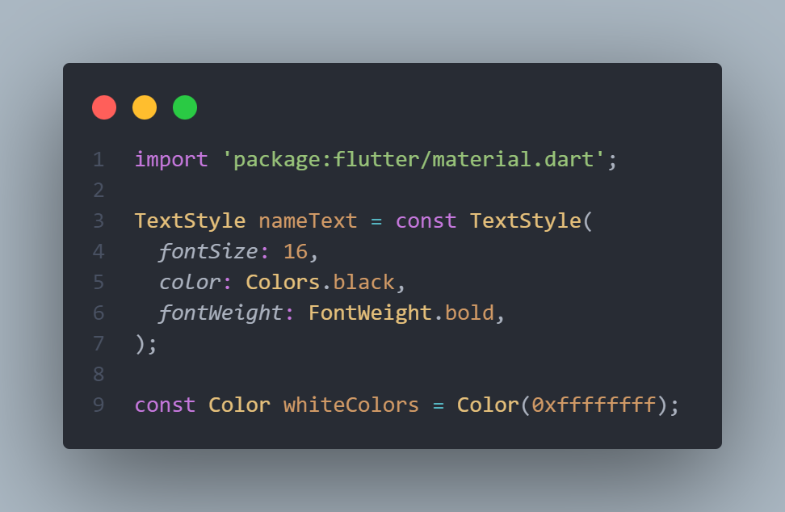
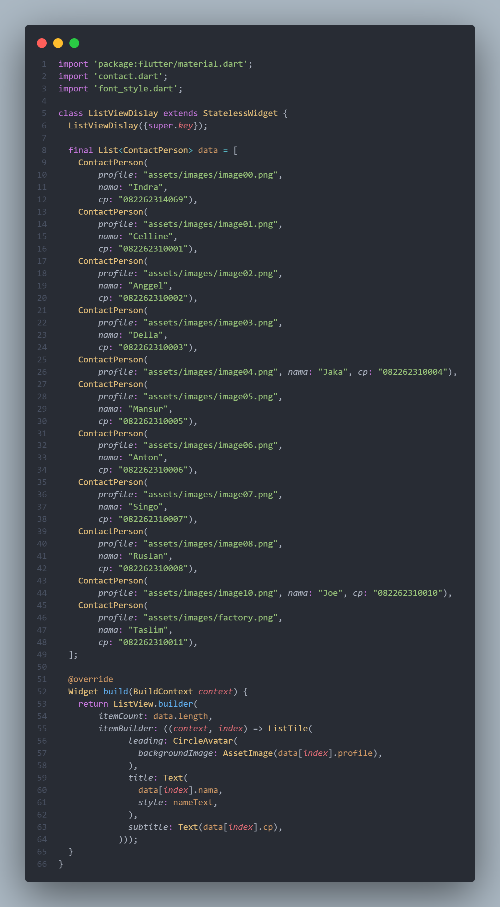
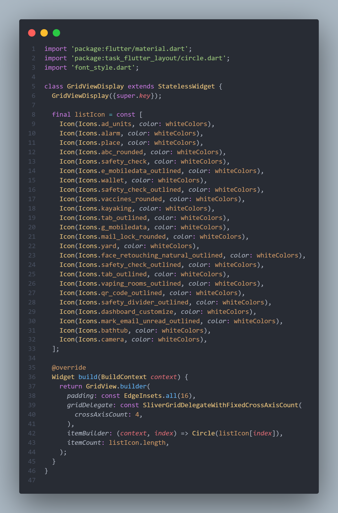
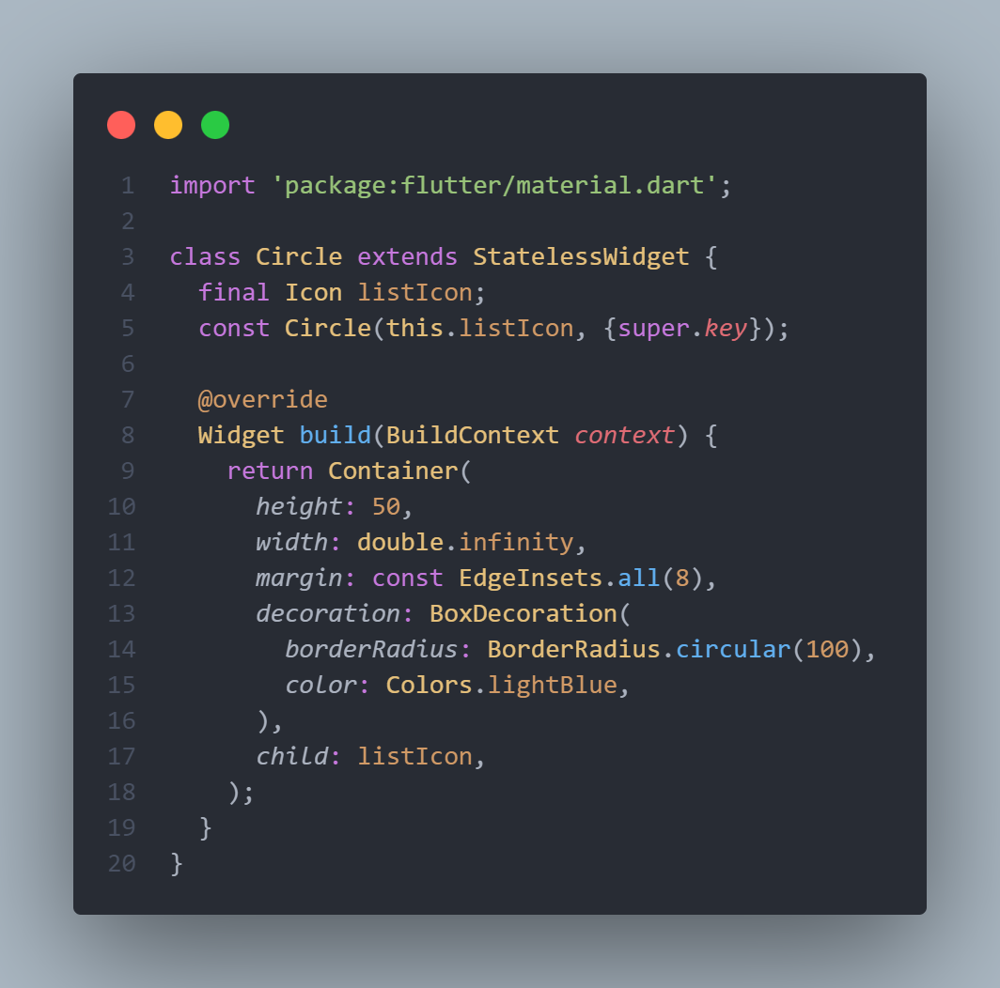
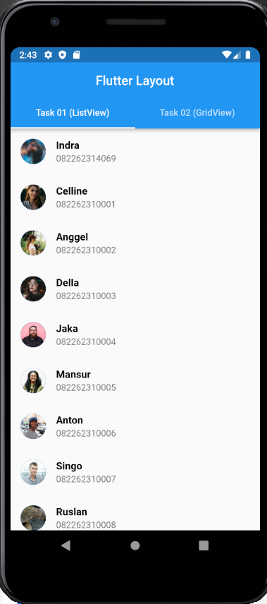
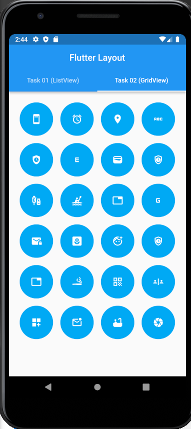

# (15) Flutter Layout

## Data Diri

Nomor Urut : 1_023FLB_52
Nama : Ruslan

## Summary

Di section ini saya belajar tentang Flutter Layout yang meliputi :

- Layout merupakan tempat untuk mengatur tata letak yang membentuk widget dan mengatur widget di dalam nya

---

- Single-child layout
  Widget ini hanya memiliki sebuah child, seperti :

  - Container
    Container memberikan tampilan seperti sebuah box dan dapat membungkus widget lain dan juga memiliki margin, padding dan border.
  - Center
    widget center akan memenuhi lebar dan tinggi ruang diluarnnya dan membungkus widget lain sebagain child nya, setiap widget yang menjadi child dari widget center maka widget tersebut akan diletakan pada bagian tengah.
  - SizedBox
    Widget SizedBox merupakan bentuk sederhana dari container karena hanya memiliki beberapa properti yaitu hild, width, height yang dapat digunakan untuk mengatur lebar dan tinggi dari widget child nya

---

- Multi-child layout
  Widget ini hanya memiliki lebih dari satu child yang menggunakan property children yang tipe nya array widget. contoh multi-child layout :

  - Widget Column
    widget yang digunakan untuk mengatur widget secara vertikal

  - Widget Row
    widget yang digunakan untuk mengatur widget secara horizontal

  - Widget ListView
    widget ListView digunakan untuk mengatur widget children nya dalam bentuk list yang memiliki kemampuan scroll

  - Widget GridView
    widget - Widget GridView
    digunakan untuk mengatur widget children nya dalam bentuk galeri dan bisa menggunakan count untuk menentukan jumlah grid yang akan digunakan

---

##Task

Berikut code dari task section 15 :

- File Styling
  
  Pada file ini saya beri nama font style di dalam file font style ini membuat sebuah TextStyle dengan nama nameText dengan style fontSize 16, berwarna bitam dan tebal yang bertujuan jika terdapat text dengan styling yang sama maka tidak perlu lagi melakukan styling satu per satu. dan pada file ini jg terdapat 1 Color dengan nama whiteColors yang di set nilai nya menjadi warna putih yang tujuannya sama seperti textStyle.

  ***

  ###Task 01 (List View)

- Class Contact
  
  Pada class contact sama membuat properti profile, nama dan cp dan membuat sembuah constructor dari class tersebut.
  ***
- Class ListView
  
  Pada class ListVIew pertama tama saya mengimport material, contact dan font syle sebagai file styling, selanjutnya saya membuat sebuah list dengan nama data yang propertinya diambil dari class contact person dan value nya di isi kedalam list tersebut. selanjutnya adalah membuat sebuah list view builder dengan itemcount panjang dari list data dengan item builder list tile dimana value dari list tile leading dimabil dari profile, title diambil dari nama dan subtitle diambil dari cp
  ***

###Task 02 (Grid View)

- Class GridView
  
  Pada class ini saya membuat sebuah list icon yang isinya beberapa icon dengan color white color dari file styling dan selanjutnya membuat sebuah gridView Builder dengan padding 16 dan grid delegate crossexitcount atau panjang dari grid nya bernilai 4 dan untuk itembuilder nya diambil dari class Circle dengan value list icon dan untuk item count nya merupakan banyak dari list icon tersebut

  ***

- Class Circle
  
  Pada class circle ini saya buat dengan tujuan membuat sebuah container dengan bentuk bulat untuk ditempat list icon yang nantinya ditampilkan. pada class ini saya membuat container dengan panjang 50 dan lebar double invinity denga margin 8 dengan box decoration dimana border radius nya 100 agar berbentuk bulat dan dengan warna ligb blue. dan untuk value dari container ini adalah list dari list icon yang pada class grid view.
  ***
- Hasil
  Berikut hasil dari program diatas
  
  
