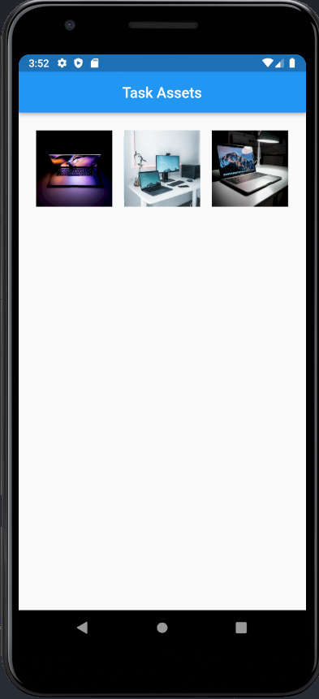
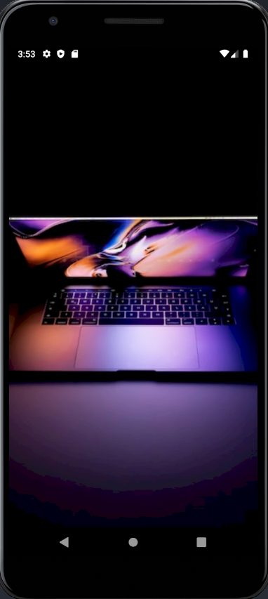
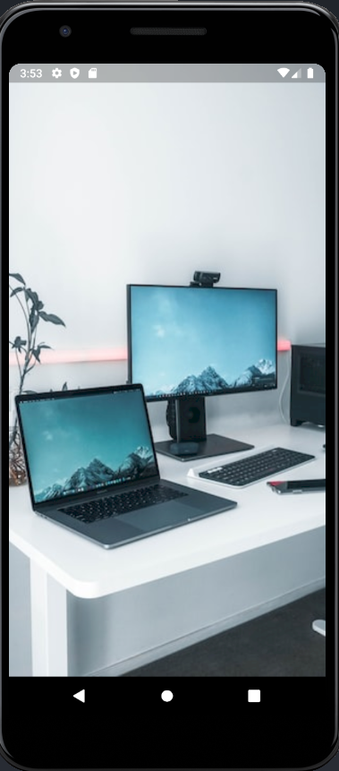
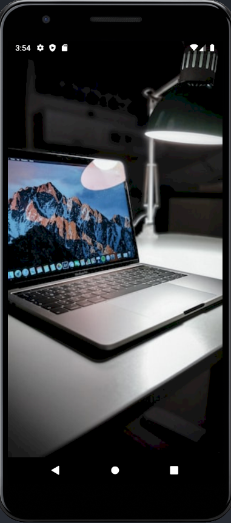

# (16) Assets

## Data Diri

Nomor Urut : 1_023FLB_52
Nama : Ruslan

##Task
####- Class Box Image

```
class BoxImage extends StatelessWidget {
  final Image listImage;
  ...

  @override
  Widget build(BuildContext context) {
    return Container(
      height: 40,
      width: 40,
      margin: const EdgeInsets.all(8),
      decoration: BoxDecoration(
        borderRadius: BorderRadius.circular(10),
        color: Colors.lightBlue,
      ),
      child: listImage,
    );
  }
}
```

Pertama tama saya membuat sebuah class BoxImage untuk membungkus image yang akan ditampilkan kedalam grid. Di dalam class box image sama membuat sebuah fvariabel dengan tipe Image untuk menampung nilai image yang akan dimasukan kedalam container dan saya membuat container dengan dengan panjang dan lebar 40 dengan margin 8 dengan border radius 10 dan berwarna biru dan untuk child dari container tersebut adalah hasil dari variabel listImage.

#### - Class Grid View

```
class GridViewDisplay extends StatelessWidget {
  GridViewDisplay({super.key});

  final listImage = [
    Image.network(
      "https://images.unsplash.com/photo-1542393545-10f5cde2c810?ixlib=rb-1.2.1&ixid=MnwxMjA3fDB8MHxwaG90by1wYWdlfHx8fGVufDB8fHx8&auto=format&fit=crop&w=465&q=80",
      fit: BoxFit.cover,
    ),
    Image.network(
      "https://images.unsplash.com/photo-1566647387313-9fda80664848?ixlib=rb-1.2.1&ixid=MnwxMjA3fDB8MHxwaG90by1wYWdlfHx8fGVufDB8fHx8&auto=format&fit=crop&w=465&q=80",
      fit: BoxFit.cover,
    ),
    Image.network(
      "https://images.unsplash.com/photo-1578950435899-d1c1bf932ab2?ixlib=rb-1.2.1&ixid=MnwxMjA3fDB8MHxwaG90by1wYWdlfHx8fGVufDB8fHx8&auto=format&fit=crop&w=435&q=80",
      fit: BoxFit.cover,
    ),
  ];
```

Pada class Grid view sama membuat sebuah listImage yang nilai nya diambil dari image di internet dengan format box cover

```
Widget build(BuildContext context) {
    return GridView.builder(
      padding: const EdgeInsets.all(16),
      gridDelegate: const SliverGridDelegateWithFixedCrossAxisCount(
        crossAxisCount: 3,
      ),
      itemCount: listImage.length,
      itemBuilder: (context, index) {
        var gambar = listImage.elementAt(index);

        return InkWell(
          child: BoxImage(listImage[index]),
          onTap: () => Navigator.of(context).push(
            MaterialPageRoute(
              builder: (context) => SecondScreen(gambar),
            ),
          ),
        );
      },
    );
  }
```

Pada class grid view saya mereturn GridView bulder dengan padding 16 dan panjang dari grid nya adalah 3 dan untuk item bulder nya mengambil nilai dari list Image yang di buat diatas lalu pada item bulder akan mereturn sebuah inkwell dengan child class BoxImage yang value nya diambil dari index dari listImage dan jika image yang terdapat di boximage tersebut di tekan makan aimage tersebut akan dikirim ke seocnd page dengan navigator

#### - Class Second Page

```
class SecondScreen extends StatefulWidget {
  final Image gambar;
  ...
}

class _SecondScreenState extends State<SecondScreen> {
  @override
  Widget build(BuildContext context) {
    return MaterialApp(
      debugShowCheckedModeBanner: false,
      home: Scaffold(
        body: SizedBox(
          height: double.infinity,
          width: double.infinity,
          child: widget.gambar,
        ),
      ),
    );
  }
}
```

Pada class Second page pertama tama saya membuat sebuah variabel gambar dengan tipe Image untuk menampung image yang dikirimkan dari page pertama atau page grid view. dan ada page second page ini saya membuat sebuah sizebox di bagian body dengan panjang dan lebar memenuhi layar dan child dari sizebox tersebut adalah nilai dari variabel gambar yang dikirimkan dari gridView

#### - Main page

```
class _MyAppState extends State<MyApp> {
  @override
  Widget build(BuildContext context) {
    return MaterialApp(
      debugShowCheckedModeBanner: false,
      home: Scaffold(
        appBar: AppBar(
          title: const Text(
            "Task Assets",
          ),
          centerTitle: true,
        ),
        body: GridViewDisplay(),
      ),
    );
  }
}
```

Pada class main saya membuat material app dengan home scaffold yang dimana body dari widget scaffold tersebut adalah page GridView

#### - Hasil

Berikut hasil dari code program diatas




