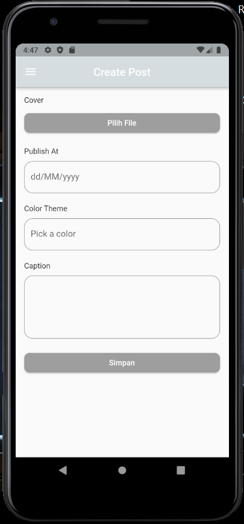
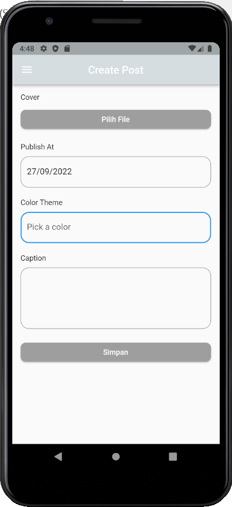
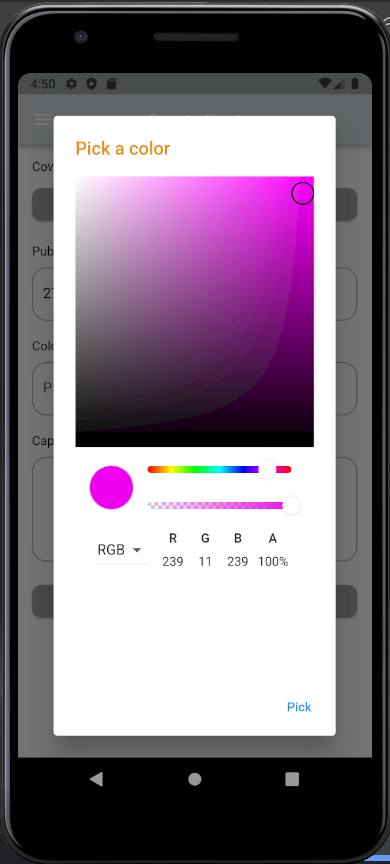
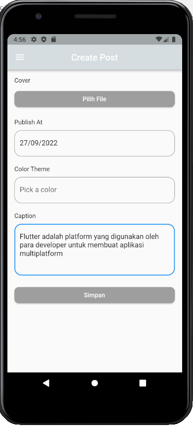
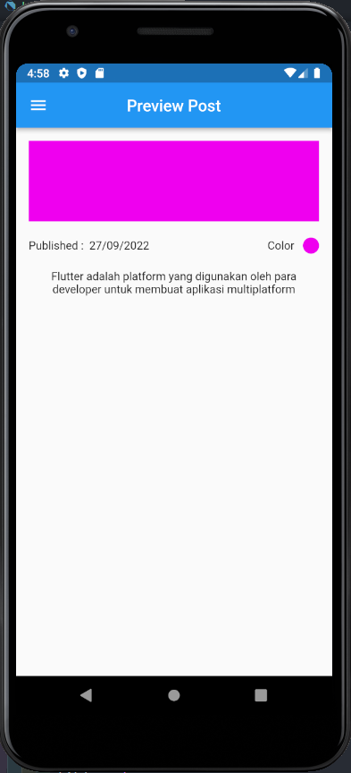

# (18) Form Picker

## Data Diri

Nomor Urut : 1_023FLB_52
Nama : Ruslan

## Task

#### - custom_color.dart

```
const Color whiteColor = Color(0xffF7F8F9);
const Color blueColor = Color(0xff1152FD);
const Color greyColor = Color(0xffD5DDE0);
const Color blackColor = Color(0xff3E4958);
```

Saya membuat sebuah file dengan nama custom color yang digunakan untuk menyimpan warna yang akan digunakaan dalam project ini.

#### - Home Page

##### - Dependencies

Berikut dependencies yang saya gunakan dalam project ini

```
dependencies:
  flutter:
    sdk: flutter

  intl: ^0.17.0
  flutter_colorpicker: ^1.0.3
  file_picker: ^4.3.3
  open_file: ^3.2.1
```

##### - Build File Picker

```
Widget builFilePicker(BuildContext context) {
    return Column(
      crossAxisAlignment: CrossAxisAlignment.start,
      children: [
        Text("Cover"),
        SizedBox(height: 10),
        Container(
          width: double.infinity,
          child: ElevatedButton(
            onPressed: _pickFile,
            child: Text("Pilih File"),
            style: ButtonStyle(
              shape: MaterialStatePropertyAll(
                RoundedRectangleBorder(
                  borderRadius: BorderRadius.circular(10),
                ),
              ),
              backgroundColor:
                  const MaterialStatePropertyAll<Color>(Colors.grey),
            ),
          ),
        ),
      ],
    );
  }

  void _pickFile() async {
    final result = await FilePicker.platform.pickFiles();
    if (result == null) return;

    final file = result.files.first;
    _openFile(file);
  }

  void _openFile(PlatformFile file) {
    OpenFile.open(file.path);
  }
```

Pada file picker saya membuat sebuah function dengan nama open file untuk mengambil file dari strage dengan file picker dan saya juga membuat sebuah function untuk membuka file yang di pilih. untuk membuka file saya membuat sebuah buttondengan child pilih file

##### - Build Color Picker

```
Widget buildColorPicker(BuildContext context) {
    return Column(
      crossAxisAlignment: CrossAxisAlignment.start,
      children: [
        const Text("Color Theme"),
        SizedBox(height: 10),
        Container(
          width: double.infinity,
          child: TextFormField(
            decoration: InputDecoration(
              hintText: "Pick a color",
              border: OutlineInputBorder(
                borderRadius: BorderRadius.circular(16),
              ),
            ),
            controller: _colorController,
            onTap: () {
              showDialog(
                context: context,
                builder: (context) {
                  return AlertDialog(
                    title: Text(
                      "Pick a color",
                      style: TextStyle(color: _currentColor),
                    ),
                    content: ColorPicker(
                      pickerColor: _currentColor,
                      onColorChanged: (color) {
                        setState(
                          () {
                            _currentColor = color;
                          },
                        );
                      },
                    ),
                    actions: [
                      TextButton(
                        onPressed: () {
                          Navigator.pop(context);
                        },
                        child: Text("Pick"),
                      )
                    ],
                  );
                },
              );
            },
          ),
        ),
      ],
    );
  }
```

Pada color picker saya membuat sebuah input text field dimana akan memilih warna dari color picker

##### - Build Date Picker

```
Widget buildColorPicker(BuildContext context) {
    return Column(
      crossAxisAlignment: CrossAxisAlignment.start,
      children: [
        const Text("Color Theme"),
        SizedBox(height: 10),
        Container(
          width: double.infinity,
          child: TextFormField(
            decoration: InputDecoration(
              hintText: "Pick a color",
              border: OutlineInputBorder(
                borderRadius: BorderRadius.circular(16),
              ),
            ),
            controller: _colorController,
            onTap: () {
              showDialog(
                context: context,
                builder: (context) {
                  return AlertDialog(
                    title: Text(
                      "Pick a color",
                      style: TextStyle(color: _currentColor),
                    ),
                    content: ColorPicker(
                      pickerColor: _currentColor,
                      onColorChanged: (color) {
                        setState(
                          () {
                            _currentColor = color;
                          },
                        );
                      },
                    ),
                    actions: [
                      TextButton(
                        onPressed: () {
                          Navigator.pop(context);
                        },
                        child: Text("Pick"),
                      )
                    ],
                  );
                },
              );
            },
          ),
        ),
      ],
    );
  }
```

Pada build date picker saya membuat sebuah input textfield dengan memanggil datepicker yang jika di klik akan membuka material date dari android dan jika isi value nya akan berubah sesuai date yang dipilih

##### - Preview Page

```
class PreviewPage extends StatefulWidget {
  String submited;
  Color warna;
  String caption;

  PreviewPage(this.submited, this.warna, this.caption, {super.key});

  @override
  State<PreviewPage> createState() => _PreviewPageState();
}

class _PreviewPageState extends State<PreviewPage> {
  @override
  Widget build(BuildContext context) {
    return MaterialApp(
      debugShowCheckedModeBanner: false,
      home: Scaffold(
        appBar: AppBar(
          title: Text("Preview Post"),
          centerTitle: true,
        ),
        drawer: Drawer(),
        body: Padding(
          padding: EdgeInsets.all(16),
          child: Column(
            children: [
              Container(
                width: double.infinity,
                height: 100,
                color: widget.warna,
              ),
              const SizedBox(height: 20),
              Row(
                mainAxisAlignment: MainAxisAlignment.spaceBetween,
                children: [
                  Text("Published :  ${widget.submited}"),
                  Row(
                    children: [
                      const Text("Color"),
                      const SizedBox(width: 10),
                      Container(
                        width: 20,
                        height: 20,
                        decoration: BoxDecoration(
                            color: widget.warna,
                            borderRadius: BorderRadius.circular(10)),
                      )
                    ],
                  )
                ],
              ),
              const SizedBox(height: 20),
              Text(
                widget.caption,
                textAlign: TextAlign.center,
              )
            ],
          ),
        ),
      ),
    );
  }
}
```

Pada previde page saaya membuat 3 variabel untuk menerima data dari home page dan data tersebut ditampilkan di page tersebut

##### - Body Home Page

```
body: Padding(
        padding: EdgeInsets.all(16),
        child: SingleChildScrollView(
          child: Form(
            key: formKey,
            child: Column(
              crossAxisAlignment: CrossAxisAlignment.start,
              children: [
                builFilePicker(context),
                const SizedBox(height: 20),
                buildDatePicker(context),
                const SizedBox(height: 20),
                buildColorPicker(context),
                const SizedBox(height: 20),
                const Text("Caption"),
                const SizedBox(height: 10),
                TextField(
                  maxLines: 4,
                  controller: _textEditingController,
                  decoration: InputDecoration(
                    border: OutlineInputBorder(
                      borderRadius: BorderRadius.circular(16),
                    ),
                  ),
                ),
                const SizedBox(height: 20),
                Container(
                  width: double.infinity,
                  child: ElevatedButton(
                    onPressed: () {
                      var push = Navigator.of(context).push(
                        MaterialPageRoute(
                          builder: (context) => PreviewPage(
                            _dueDate.text,
                            _currentColor,
                            _textEditingController.text,
                          ),
                        ),
                      );
                    },
                    child: Text("Simpan"),
                    style: ButtonStyle(
                      shape: MaterialStatePropertyAll(
                        RoundedRectangleBorder(
                          borderRadius: BorderRadius.circular(10),
                        ),
                      ),
                      backgroundColor:
                          const MaterialStatePropertyAll<Color>(Colors.grey),
                    ),
                  ),
                ),
              ],
            ),
          ),
        ),
      ),
```

##### - Main Page

```
class _MyAppState extends State<MyApp> {
  @override
  Widget build(BuildContext context) {
    return MaterialApp(
      debugShowCheckedModeBanner: false,
      home: HomePage(),
    );
  }
}
```

##### - Hasil






