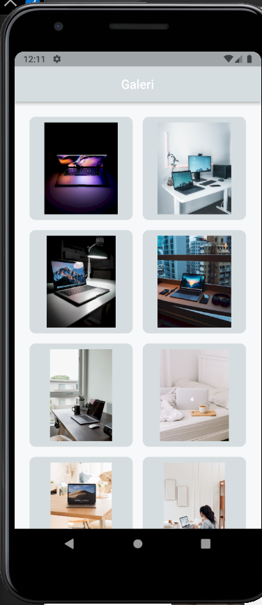
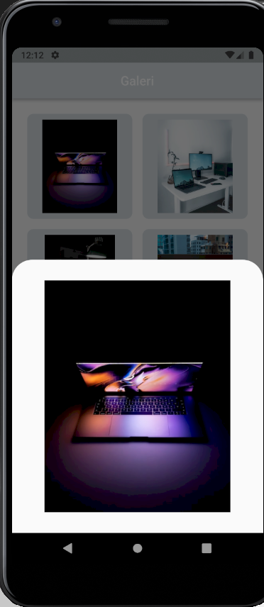
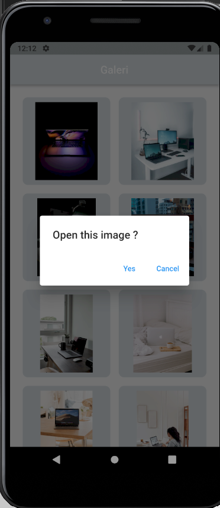
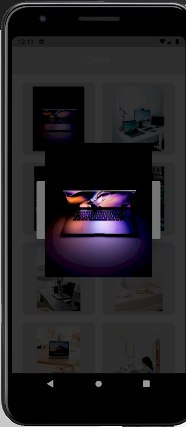

# (19) Dialog Bottom Sheet

## Data Diri

Nomor Urut : 1_023FLB_52
Nama : Ruslan

## Task

#### - Custom Color

```
import 'package:flutter/material.dart';

const Color whiteColor = Color(0xffF7F8F9);
const Color blueColor = Color(0xff1152FD);
const Color greyColor = Color(0xffD5DDE0);
const Color blackColor = Color(0xff3E4958);
```

Pada custom color saya menginisalisasi color yang akan digunakan

#### - Box Image

```
class BoxImage extends StatelessWidget {
  final String _listImage;
  const BoxImage(this._listImage, {super.key});
  ...
    return Padding(
      padding: const EdgeInsets.all(8.0),
      child: Container(
        padding: const EdgeInsets.all(8),
        decoration: BoxDecoration(
          border: Border.all(color: greyColor),
          borderRadius: BorderRadius.circular(10),
          color: greyColor,
        ),
        child: Container(
          width: 100,
          decoration: BoxDecoration(
            image: DecorationImage(
              image: NetworkImage(_listImage),
            ),
            borderRadius: const BorderRadius.all(
              Radius.circular(16),
            ),
          ),
        ),
      ),
   ...
}
```

Pada box image saya membuat sebuah padding dengan body container yang isi dari container tersebut adalah list image yang ada di halaman grid view

#### - Home Page

######List Image

```
final listImage = [
    "https://images.unsplash.com/photo-1542393545-10f5cde2c810?ixlib=rb-1.2.1&ixid=MnwxMjA3fDB8MHxwaG90by1wYWdlfHx8fGVufDB8fHx8&auto=format&fit=crop&w=465&q=80",
    "https://images.unsplash.com/photo-1566647387313-9fda80664848?ixlib=rb-1.2.1&ixid=MnwxMjA3fDB8MHxwaG90by1wYWdlfHx8fGVufDB8fHx8&auto=format&fit=crop&w=465&q=80",
    "https://images.unsplash.com/photo-1578950435899-d1c1bf932ab2?ixlib=rb-1.2.1&ixid=MnwxMjA3fDB8MHxwaG90by1wYWdlfHx8fGVufDB8fHx8&auto=format&fit=crop&w=435&q=80",
    "https://images.unsplash.com/photo-1530893609608-32a9af3aa95c?ixlib=rb-1.2.1&ixid=MnwxMjA3fDB8MHxwaG90by1wYWdlfHx8fGVufDB8fHx8&auto=format&fit=crop&w=464&q=80",
    "https://images.unsplash.com/photo-1526657782461-9fe13402a841?ixlib=rb-1.2.1&ixid=MnwxMjA3fDB8MHxwaG90by1wYWdlfHx8fGVufDB8fHx8&auto=format&fit=crop&w=392&q=80",
    "https://images.unsplash.com/photo-1543652437-15ae836b33e3?ixlib=rb-1.2.1&ixid=MnwxMjA3fDB8MHxwaG90by1wYWdlfHx8fGVufDB8fHx8&auto=format&fit=crop&w=435&q=80",
    "https://images.unsplash.com/photo-1565630916779-e303be97b6f5?ixlib=rb-1.2.1&ixid=MnwxMjA3fDB8MHxwaG90by1wYWdlfHx8fGVufDB8fHx8&auto=format&fit=crop&w=1887&q=80",
    "https://images.unsplash.com/photo-1587614297696-d150ef162d88?ixlib=rb-1.2.1&ixid=MnwxMjA3fDB8MHxwaG90by1wYWdlfHx8fGVufDB8fHx8&auto=format&fit=crop&w=387&q=80"
  ];
```

Diatas adalah list image yang diambil dari internet yang disimpan kedalam variabel listImage

#####Grid View Builder

```
return GridView.builder(
      padding: const EdgeInsets.all(16),
      gridDelegate: const SliverGridDelegateWithFixedCrossAxisCount(
        crossAxisCount: 2,
      ),
      itemCount: listImage.length,
      itemBuilder: (context, index) {
        ...
      },
    );
```

Pada grid view builder dengan grid delegate dan corssAxixCount 2 agar jumlah dari grid nya sebanyak 2 dan untuk item count nya jumlah dari listImage dan untuk item builder nya nantnya akan berisi konten.

###### Model Buttom Sheet

```
return InkWell(
  child: BoxImage(listImage[index]),
  onTap: () => showModalBottomSheet(
    context: context,
    shape: const RoundedRectangleBorder(
      borderRadius: BorderRadius.vertical(
        top: Radius.circular(32),
      ),
    ),
    builder: (context) => Padding(
      padding: const EdgeInsets.all(16),
      child: Padding(
        padding: const EdgeInsets.all(16),
        child: Container(
          decoration: BoxDecoration(
            image: DecorationImage(
              image: NetworkImage(listImage[index]),
            ),
          ),
        ),
      ),
    ),
  ),
  ...
  ),
);
```

Pada item builder yang bertama saya merentun inkwell dengna onTap menampilkan showModelBottomSheet dengan radius top 32 dan dengan contont image yang di klik pada listImage

######Alert Dialog

```
return InkWell(
  child: BoxImage(listImage[index]),
  ...
  onLongPress: () => showDialog(
    context: context,
    builder: (context) {
      return AlertDialog(
        title: const Text('Open this image ? '),
        actions: [
          TextButton(
            onPressed: () {
              showDialog(
                context: context,
                builder: (context) {
                  return Padding(
                    padding: EdgeInsets.all(75),
                    child: Container(
                      decoration: BoxDecoration(
                        image: DecorationImage(
                          image: NetworkImage(listImage[index]),
                        ),
                      ),
                    ),
                  );
                },
              );
            },
            child: const Text('Yes'),
          ),
          TextButton(
            onPressed: () {
              Navigator.pop(context);
            },
            child: const Text('Cancel'),
          ),
        ],
      );
    },
  ),
);
```

Masih pada inkwell saya membuat onLongPress dengan alert dialog untuk membuka gambar dan terdapat 2 pilihan button, jika pilih cancel maka akan keluar dari alert dialog dan jika pilih yes maka gambar akan dibuka

#### - Hasil

Berikut hasil dari program tersebut




