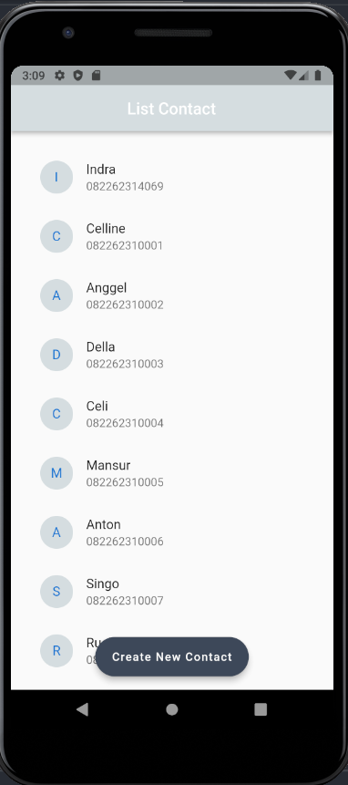
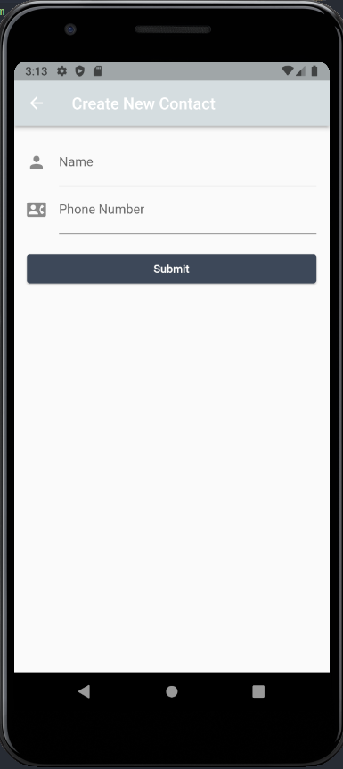

# (20) Flutter Navigation

## Data Diri

Nomor Urut : 1_023FLB_52
Nama : Ruslan

### Task

####- File custom_font.dart

```
import 'package:flutter/material.dart';

const Color whiteColor = Color(0xffF7F8F9);
const Color blueColor = Color(0xff1152FD);
const Color greyColor = Color(0xffD5DDE0);
const Color blackColor = Color(0xff3E4958);
```

Pada file ini saya menginisialisasi warna yang akan saya gunakan di project ini

####- Model Kontak

```
class ContactPerson {
  late String id;
  String nama;
  String phone;

  ContactPerson({
    required this.nama,
    required this.phone,
  }) {
    id = nanoid(5);
  }
}
```

Pada class contact person ini saya membuat model dengan required nama dan no telp dan untuk id saya menggunakan nanoid yang nanti di generate secara otomatis ketika nama dan no telp nya terisi

####- Home Page

```
class HomePage extends StatefulWidget {
  static const routeName = '/contact';
  const HomePage({super.key});

  @override
  State<HomePage> createState() => _HomePageState();
}
```

Pada add contacp page sama membuat sebuha route contact dengan nama routeName

```
final List<ContactPerson> data = [
    ContactPerson(nama: "Indra", phone: "082262314069"),
    ContactPerson(nama: "Celline", phone: "082262310001"),
    ContactPerson(nama: "Anggel", phone: "082262310002"),
    ContactPerson(nama: "Della", phone: "082262310003"),
    ContactPerson(nama: "Celi", phone: "082262310004"),
    ContactPerson(nama: "Mansur", phone: "082262310005"),
    ContactPerson(nama: "Anton", phone: "082262310006"),
    ContactPerson(nama: "Singo", phone: "082262310007"),
    ContactPerson(nama: "Ruslan", phone: "082262310008"),
    ContactPerson(nama: "Indra", phone: "082262310010"),
    ContactPerson(nama: "Taslim", phone: "082262310011"),
  ];
```

Pada home page pertama tama saya membuat list dengan nama data yang diambil dari contructor class contact person lalu memasukan data kedalam list tersebut yang berupa nama dan no telp

```
Padding(
  padding: const EdgeInsets.all(20),
  child: ListView.builder(
      itemCount: data.length,
      itemBuilder: ((context, index) => ListTile(
            leading: CircleAvatar(
              backgroundColor: greyColor,
              child: Text(data[index].nama[0]),
            ),
            title: Text(data[index].nama),
            subtitle: Text(data[index].phone),
          ))),
),
```

Kemudian saya menampilkan list data kontak person yang sebelumnya dibuat dengan menggunakan widget padding dengan padiing 20 dengan child list view builder yang dimana pada leading saya menampilkan huruf pertama dari nama dengan bacground color grey dan untuk title dan subtitle diambil dari indeks nama dan no telp

```
floatingActionButton: FloatingActionButton.extended(
  onPressed: () {
    Navigator.push(
      context,
      MaterialPageRoute(builder: (context) => const AddContact()),
    );
  },
  label: const Text("Create New Contact"),
  backgroundColor: blackColor,
),
floatingActionButtonLocation: FloatingActionButtonLocation.centerFloat,
```

Kemudian saya membuat sebuah floating action button dengan label "Create New Contact" dengan bacgroup color black color yang diambil dari file custom color dan saya melakukan set agar floating action button tersebut berada di tengah dengan floating action button location yang dimana jika tombol tersebut di klik maka akan pindah ke halaman create new contact.

####- Add Contact Page

```
class AddContact extends StatefulWidget {
  static const routeName = '/formContact';
  const AddContact({super.key});

  @override
  State<AddContact> createState() => _AddContactState();
}
```

Pada add contacp page sama membuat sebuha route formContact dengan nama routeName

```
Padding(
    padding: const EdgeInsets.all(16),
    child: SingleChildScrollView(
      key: formKey,
      child: Form(
        child: Column(
          children: [
            TextFormField(
              decoration: const InputDecoration(
                icon: Icon(Icons.person),
                label: Text("Name"),
                hintText: "Name",
              ),
              validator: (value) {
                if (value == null || value.length < 3) {
                  return "Silahkan input nama dengan benar";
                }
                return null;
              },
            ),
            TextFormField(
              decoration: const InputDecoration(
                icon: Icon(Icons.contact_phone),
                label: Text("Phone Number"),
                hintText: "Phone Number",
              ),
              validator: (value) {
                if (value == null || value.length < 3) {
                  return "Silahkan input nama dengan benar";
                }
                return null;
              },
            ),
            Padding(
              padding: const EdgeInsets.only(top: 20),
              child: SizedBox(
                width: double.infinity,
                child: ElevatedButton(
                  style:
                      ElevatedButton.styleFrom(backgroundColor: blackColor),
                  onPressed: () {
                    if (formKey.currentState != null &&
                        formKey.currentState!.validate()) {
                      _onSubmit();
                      const SnackBar(content: Text("Menyimpan Data...."));
                      Navigator.of(context).pop();
                    }
                  },
                  child: const Text("Submit"),
                ),
              ),
            )
          ],
        ),
      ),
    ),
)
```

Pada add contac page saya membuat sebuah padding dengan child single child scroll view yang memiliki child column yang berisikan 2 buah widget text form filed dan sebuah elevated button. pada text form view yang pertama saya membuat input decoration dengan label dan hint name dan subuah icon person dan pada text form view yang kedua saya membuat input decoration dengan label dan hint phone number dan subuah icon add contact yang terakhir saya membuat sebuah elevated button yang dibungkus kedalam widget padding dengan chil text sumbit dan bacground color black color

####- Main Page

```
class _MyAppState extends State<MyApp> {
  @override
  Widget build(BuildContext context) {
    return MaterialApp(
      initialRoute: HomePage.routeName,
      routes: {
        HomePage.routeName: (context) => const HomePage(),
        AddContact.routeName: (context) => const AddContact(),
      },
      debugShowCheckedModeBanner: false,
      home: HomePage(),
    );
  }
}
```

Pada main page saya menginisialisasi root dengan routeName dari HomePage agar tampilan yang pertama kali dibuka

####- hasil
Berikut hasil dari program diatas


