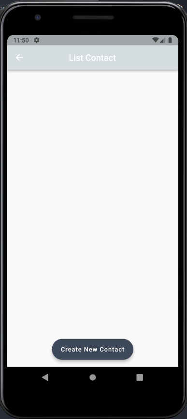
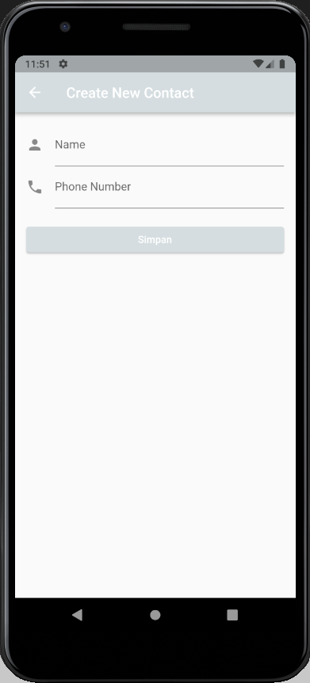
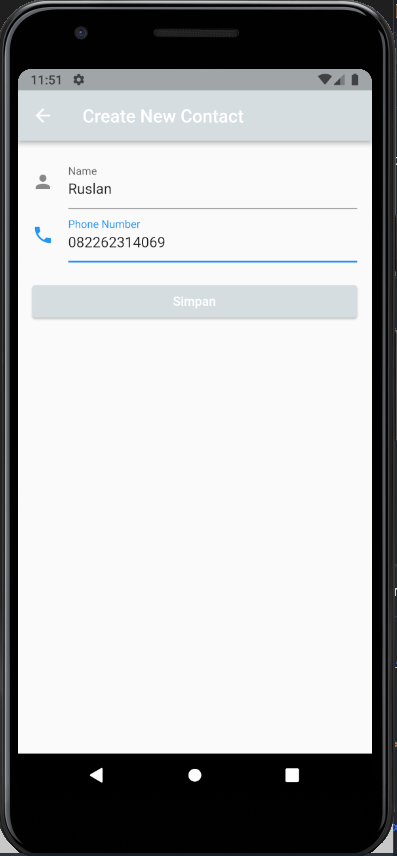
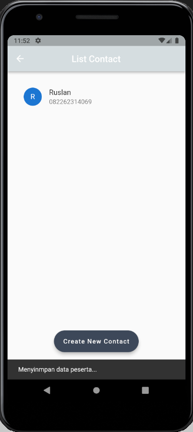
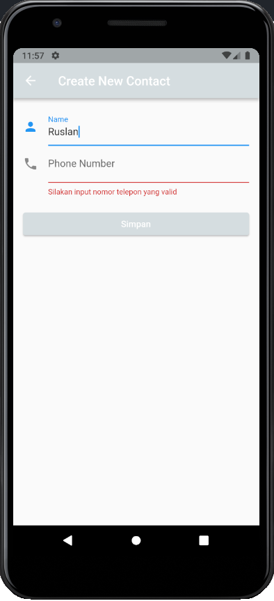
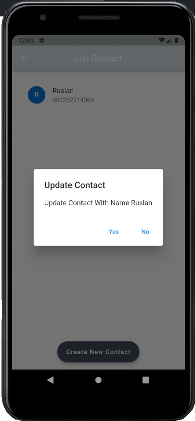
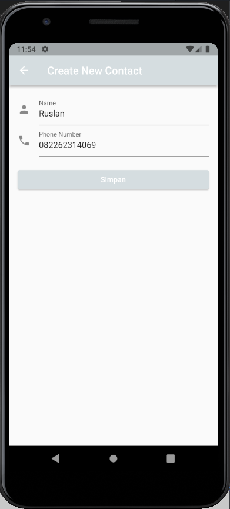
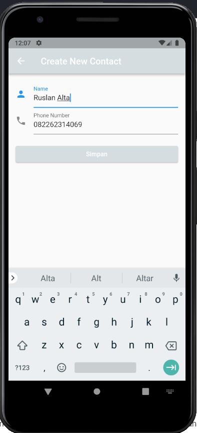
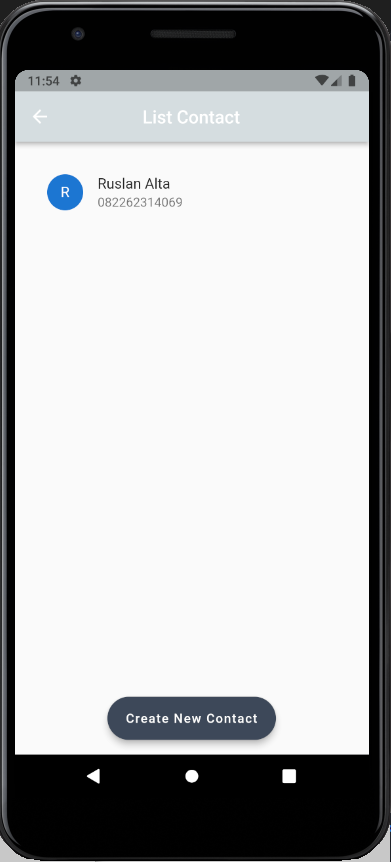
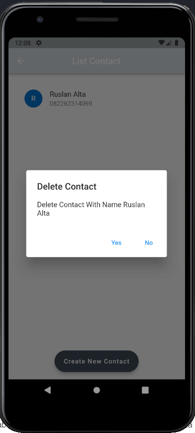

# (21) Flutter State Management (Provider)

## Data Diri

Nomor Urut : 1_023FLB_52
Nama : Ruslan

## Task 02 Dengan menggunakan state management Biasa (Set State)

- Dependencies
  Berikut adalah package yang saya gunakan dalam project ini

```
dependencies:
  flutter:
    sdk: flutter
  cupertino_icons: ^1.0.2
  nanoid: ^1.0.0
```

- Style (custom_color.dart)

```
const Color whiteColor = Color(0xffF7F8F9);
const Color blueColor = Color(0xff1152FD);
const Color greyColor = Color(0xffD5DDE0);
const Color blackColor = Color(0xff3E4958);
```

Pada file ini saya menginisialisasi color yang sya gunakan pada project ini

- Model (contact_person.dart)

```
import 'package:nanoid/nanoid.dart';

class ContactPerson {
  late String id;
  String nama;
  String phone;

  ContactPerson({
    required this.nama,
    required this.phone,
  }) {
    id = nanoid(5);
  }
}

```

Pertama tama saya membuat model dengan nama ContactPesrson dengan required nama dan nomor telepon dan untuk id saya menggunakan nano id dengan panjang karakter sebanyak 5.

- Widget (contact_item.dart)

```
class ContactItem extends StatelessWidget {
  final ContactPerson contactPerson;
  const ContactItem(this.contactPerson, {super.key});

  @override
  Widget build(BuildContext context) {
    return ListTile(
      leading: CircleAvatar(
        child: Text(contactPerson.nama[0]),
      ),
      title: Text(contactPerson.nama),
      subtitle: Text(contactPerson.phone),
    );
  }
}
```

Pada widget ini saya membuat sebuah stateless dengan nama ContactItem yang isinya saya membuat sebuah variabel contactPerson dari model ContactPerson dan menambahkan constructor dari class tersebut kemudian saya mereturn ListTile dengan properti leading CircleAvatar yang berisikan huruf pertama dari nama, kemudian pada title saya membuat text yang diambil dari variabel contactPerson dengan value nama.

- Home Page

```
class HomePage extends StatefulWidget {
  static const routeName = '/contact';
  const HomePage({super.key});

  @override
  State<HomePage> createState() => _HomePageState();
}

class _HomePageState extends State<HomePage> {
  final List<ContactPerson> dataKontak = [];

  void tambahKontak(ContactPerson contactPerson) {
    setState(() {
      dataKontak.add(contactPerson);
    });
  }

  @override
  Widget build(BuildContext context) {
    ...
  }
}
```

Pada home page saya membuat sebuah variabel routeName untuk menginisalisasikan root pada home page, selanjutnya saya pada bagian build saya membuat sebuah variabel dataKontak yang diambil dari provider yang berisikan list contact person (cp) dan saya membuat sebuah methon tambahKontak dengan untuk menambahkan kontak yang di inputkan di form ke model

```
Widget build(BuildContext context) {
    return Scaffold(
      appBar: AppBar(
        title: const Text("List Contact"),
        centerTitle: true,
        backgroundColor: greyColor,
      ),
      body: Padding(
        padding: const EdgeInsets.all(20),
        child: ListView.separated(
          itemBuilder: ((context, index) {
            final kontak = dataKontak.elementAt(index);
            return ContactItem(kontak);
          }),
          separatorBuilder: (context, index) => const Divider(),
          itemCount: dataKontak.length,
        ),
      ),
      floatingActionButton: FloatingActionButton.extended(
        onPressed: () {
          Navigator.pushNamed(context, AddContactPage.routeName,
              arguments: tambahKontak);
        },
        label: const Text("Create New Contact"),
        backgroundColor: blackColor,
      ),
      floatingActionButtonLocation: FloatingActionButtonLocation.centerFloat,
    );
  }
```

Dan pada home page saya mereturn sebuah scaffold dengan body Padding dengan child ListView.separated dengan itemBuilder mengambil data kontak dari provider yang berikan list contact person (cp) dan dengan separatorBuilder Divider dan dengan itemCount panjang dari list dataKontak.
dan saya juga membuat sebuah floatingActionButton yang berada di tengah dengan child Text("Create New Contact") yang ketika di klik akan membuka halaman add contact

- Add Contact Page

```
class AddContactPage extends StatefulWidget {
  static const routeName = '/contact/new';
  const AddContactPage({super.key});

  @override
  State<AddContactPage> createState() => _AddContactPageState();
}

class _AddContactPageState extends State<AddContactPage> {
  final formKey = GlobalKey<FormState>();
  var dataKontak = {'nama': '', 'phone': ''};

  late Function(ContactPerson) tambahKontak;

  void _onSubmit() {
    formKey.currentState!.save();
    print(dataKontak);
    final kontakBaru = ContactPerson(
      nama: dataKontak['nama']!,
      phone: dataKontak['phone']!,
    );
    tambahKontak(kontakBaru);
  }

  @override
  Widget build(BuildContext context) {
    ....
  }
}

```

Pada halaman add contact pertama tama saya membuat formKey dengan GlobalKey untuk membuat form dan variabel dataKontak ayng berisi nama dan no telp dan saya membuat method onSubmit untuk menyimpan nama dan no telp yang diimputkan nama dan no telp.

```
class AddContactPage extends StatefulWidget {
  ...

  @override
  Widget build(BuildContext context) {
    tambahKontak =
        ModalRoute.of(context)!.settings.arguments as Function(ContactPerson);
    return Scaffold(
      ...
    );
  }
}

```

pada bagian build saya memanggil variabel tambahContact dengan ModalRoute untuk argumen dari tambah contact

```
class AddContactPage extends StatefulWidget {
  ....

  @override
  Widget build(BuildContext context) {
    ...
    return Scaffold(
      appBar: AppBar(
        title: const Text("Create New Contact"),
        backgroundColor: greyColor,
      ),
      body: Padding(
        padding: const EdgeInsets.all(16),
        child: SingleChildScrollView(
          child: Form(
            key: formKey,
            child: Column(
              crossAxisAlignment: CrossAxisAlignment.stretch,
              children: [
                TextFormField(
                  decoration: const InputDecoration(
                    icon: Icon(Icons.person),
                    label: Text('Name'),
                    hintText: 'Input Name',
                  ),
                  validator: (value) {
                    if (value == null || value.length < 2) {
                      return 'Silakan input nama yang valid';
                    }
                    return null;
                  },
                  onSaved: (newValue) {
                    if (newValue != null) dataKontak['nama'] = newValue;
                  },
                  keyboardType: TextInputType.name,
                  textInputAction: TextInputAction.next,
                ),
                TextFormField(
                  decoration: const InputDecoration(
                    icon: Icon(Icons.phone),
                    label: Text('Phone Number'),
                    hintText: 'Input Phone Number',
                  ),
                  validator: (value) {
                    if (value == null || value.length < 10) {
                      return 'Silakan input nomor telepon yang valid';
                    }
                    return null;
                  },
                  onSaved: (newValue) {
                    if (newValue != null) dataKontak['phone'] = newValue;
                  },
                  keyboardType: TextInputType.name,
                  textInputAction: TextInputAction.next,
                ),
                ElevatedButton(
                  onPressed: () {
                    if (formKey.currentState != null &&
                        formKey.currentState!.validate()) {
                      _onSubmit();
                      ScaffoldMessenger.of(context).showSnackBar(
                        const SnackBar(
                          content: Text(
                            'Menyinmpan data peserta...',
                          ),
                        ),
                      );
                      Navigator.of(context).pop();
                    }
                  },
                  child: const Text('Simpan'),
                ),
              ],
            ),
          ),
        ),
      ),
    );
  }
}
```

Dan pada add page saya mereturn sebuah Scaffold dengan body Padding dengan child SingleChildScrollView dan pada SingleChildScrollView saya membat form dengan widget colum yang terdapat 2 buah TextFormField dengan masing masing controller yang sduah di buatkan sebelumnya dan juga setiap TextFormField terdapat validasi input dan terdapat sebuah ElevatedButton untuk menyimpan data yang diiinputkan pada form dengan memanggil method \_onSubmit()

- Main Page (main.dart)

```
class _MyAppState extends State<MyApp> {
  @override
  Widget build(BuildContext context) {
    return MaterialApp(
    debugShowCheckedModeBanner: false,
    home: HomePage(),
    initialRoute: HomePage.routeName,
    routes: {
      HomePage.routeName: (context) => HomePage(),
      AddContactPage.routeName: (context) => AddContactPage(),
    });
  }
}
```

Pada main page saya mereturn materialApp dengan home dari aplikasi diambil dari HomePage dan saya membuat initialRoute dengan memanggil root dari home page dan mendaftarkan route yang ada pada widget routes yaitu routeName dari HomePage yang akan ke halaman HomePage() dan routeName dari AddContactPage yang akan ke halaman AddContactPage

- Hasil
  Berikut hasil dari program diatas
  
  
  
  

## Task 02 Dengan menggunakan state management provider

- Dependencies
  Berikut adalah package yang saya gunakan dalam project ini

```
dependencies:
  flutter:
    sdk: flutter
  cupertino_icons: ^1.0.2
  nanoid: ^1.0.0
  provider: ^6.0.3
```

- Style (custom_color.dart)

```
const Color whiteColor = Color(0xffF7F8F9);
const Color blueColor = Color(0xff1152FD);
const Color greyColor = Color(0xffD5DDE0);
const Color blackColor = Color(0xff3E4958);
```

Pada file ini saya menginisialisasi color yang sya gunakan pada project ini

- Model (contact_person.dart)

```
import 'package:nanoid/nanoid.dart';

class ContactPerson {
  late String id;
  String nama;
  String phone;

  ContactPerson({
    required this.nama,
    required this.phone,
  }) {
    id = nanoid(5);
  }
}

```

Pertama tama saya membuat model dengan nama ContactPesrson dengan required nama dan nomor telepon dan untuk id saya menggunakan nano id dengan panjang karakter sebanyak 5.

- Provider (contact_provider.dart)

```
class ContactProvider with ChangeNotifier {
  final List<ContactPerson> _cp = [];

  List<ContactPerson> get cp => [..._cp];

  void tambahKontak(ContactPerson newContact) {
    _cp.add(newContact);
    notifyListeners();
  }

  void editKontak(ContactPerson updatePeserta) {
    final targetIndex = _cp.indexWhere((cp) => cp.id == updatePeserta.id);

    if (targetIndex != -1) {
      _cp[targetIndex] = updatePeserta;
      notifyListeners();
    }
  }

  void hapusKontak(String id) {
    final targetIndex = _cp.indexWhere((cp) => cp.id == id);

    if (targetIndex != -1) {
      _cp.removeAt(targetIndex);
      notifyListeners();
    }
  }
}
```

Kemudian saya membuat sebuah provider dengan class ContactProvider dengan ChangeNotifier yang didalam nya saya membuat sebuah list kosong dengan nama \_cp yang diambil dari model ContactPerson dan kemudian saya membuat getter dari list tersebut. dan pada provider ini saya membuat 3 buah event yaitu tambahKontak untuk menambahkan kontak baru, editKontak yang digunakan untuk mengedit atau mengupdate kontak yang sudah ada dan yang terakhir adalah hapusKontak untuk menghapus kontak yang sduah ada.

- Widget (contact_item.dart)

```
class ContactItem extends StatelessWidget {
  final ContactPerson contactPerson;
  const ContactItem(this.contactPerson, {super.key});

  @override
  Widget build(BuildContext context) {
    ...
  }
}
```

Pada widget ini saya membuat sebuah stateless dengan nama ContactItem yang isinya saya membuat sebuah variabel contactPerson dari model ContactPerson dan menambahkan constructor dari class tersebut

```
class ContactItem extends StatelessWidget {
  final ContactPerson contactPerson;
  const ContactItem(this.contactPerson, {super.key});

  @override
  Widget build(BuildContext context) {
    return InkWell(
      child: ListTile(
        leading: CircleAvatar(
          child: Text(contactPerson.nama[0]),
        ),
        title: Text(contactPerson.nama),
        subtitle: Text(contactPerson.phone),

      ),
      ...
    );
  }
}
```

Kemudian saya mereturn InkWell dengan child ListTile dengan properti leading CircleAvatar yang berisikan huruf pertama dari nama, kemudian pada title saya membuat text yang diambil dari variabel contactPerson dengan value nama.

```
class ContactItem extends StatelessWidget {
  final ContactPerson contactPerson;
  const ContactItem(this.contactPerson, {super.key});

  @override
  Widget build(BuildContext context) {
    return InkWell(
      ...

      ),
      onLongPress: () {
        showDialog(
          context: context,
          builder: (context) {
            return AlertDialog(
              title: const Text("Delete Contact"),
              content: Text("Delete Contact With Name ${contactPerson.nama}"),
              actions: [
                TextButton(
                  onPressed: () {
                    Provider.of<ContactProvider>(context, listen: false)
                        .hapusKontak(contactPerson.id);
                    Navigator.pop(context);
                  },
                  child: const Text("Yes"),
                ),
                TextButton(
                    onPressed: () {
                      Navigator.pop(context);
                    },
                    child: const Text("No"))
              ],
            );
          },
        );
      },
      ...
    );
  }
}
```

Masih pada InkWell saya memanggil sebuah event onLongPress yang berisikan showDialog dengan AlertDialog yang berisi title dengan text Delete Contact dan content berisi text Delete Contact With Name "nama dari kontak yang akan di hapus" dan pada actions terdapat 2 buah text button dengan child yes dan no. jika memilih no maka akan keluar dari aler dialog tersebut dengan Navigator.pop(context) dan jika memlih yes maka akan menghapus kontak tersebut yang diambil dari id kontak tersebut

```
class ContactItem extends StatelessWidget {
  final ContactPerson contactPerson;
  const ContactItem(this.contactPerson, {super.key});

  @override
  Widget build(BuildContext context) {
    return InkWell(
      ...
      onDoubleTap: () {
        showDialog(
          context: context,
          builder: (context) {
            return AlertDialog(
              title: const Text("Update Contact"),
              content: Text("Update Contact With Name ${contactPerson.nama}"),
              actions: [
                TextButton(
                  onPressed: () async {
                    await Navigator.of(context).pushNamed(
                        AddContactPage.routeName,
                        arguments: contactPerson);
                    Navigator.pop(context);
                  },
                  child: const Text("Yes"),
                ),
                TextButton(
                    onPressed: () {
                      Navigator.pop(context);
                    },
                    child: const Text("No"))
              ],
            );
          },
        );
      },
    );
  }
}
```

Masih pada InkWell saya juga memanggil sebuah event onDoubleTap yang berisikan showDialog dengan AlertDialog yang berisi title dengan text Update Contact dan content berisi text Update Contact With Name "nama dari kontak yang akan di hapus" dan pada actions terdapat 2 buah text button dengan child yes dan no. jika memilih no maka akan keluar dari aler dialog tersebut dengan Navigator.pop(context) dan jika memlih yes maka berpindah ke page add contact dengan membawa data contact yang berupa nama dan nomor telepon yang dimana jika dilakkan perubahan pada daat tersebut dan tombil simpan di tekan maka akan kembali ke home page dengan data yang sudah di update tadi.

- Home Page (home_page.dart)

```
class HomePage extends StatefulWidget {
  static const routeName = '/contact';
  ....
}

class _HomePageState extends State<HomePage> {
  @override
  Widget build(BuildContext context) {
    final dataKontak = Provider.of<ContactProvider>(context).cp;
    return Scaffold(
      appBar: AppBar(
        title: const Text("List Contact"),
        centerTitle: true,
        backgroundColor: greyColor,
      ),
      body: Padding(
        padding: const EdgeInsets.all(20),
        child: ListView.separated(
          itemBuilder: ((context, index) {
            final kontak = dataKontak.elementAt(index);
            return ContactItem(kontak);
          }),
          separatorBuilder: (context, index) => const Divider(),
          itemCount: dataKontak.length,
        ),
      ),
      floatingActionButton: FloatingActionButton.extended(
        onPressed: () {
          Navigator.pushNamed(context, AddContactPage.routeName);
        },
        label: const Text("Create New Contact"),
        backgroundColor: blackColor,
      ),
      floatingActionButtonLocation: FloatingActionButtonLocation.centerFloat,
    );
  }
}
```

Pada home page saya membuat sebuah variabel routeName untuk menginisalisasikan root pada home page, selanjutnya saya pada bagian build saya membuat sebuah variabel dataKontak yang diambil dari provider yang berisikan list contact person (cp) dan pada home page saya mereturn Scaffold dengan body Padding dengan child ListView.separated dengan itemBuilder mengambil data kontak dari provider yang berikan list contact person (cp) dan dengan separatorBuilder Divider dan dengan itemCount panjang dari list dataKontak.
dan saya juga membuat sebuah floatingActionButton yang berada di tengah dengan child Text("Create New Contact") yang ketika di klik akan membuka halaman add contact

- Halaman Add Contact (add_contact.dart)

```
class _AddContactPageState extends State<AddContactPage> {
  final formKey = GlobalKey<FormState>();
  var dataKontak = {'nama': '', 'phone': ''};

  ContactPerson? editContact;

  TextEditingController _controllerName = TextEditingController();
  TextEditingController _controllerPhone = TextEditingController();

  void _onSubmit() {
    formKey.currentState!.save();
    // const print(dataKontak);
    final kontakBaru = ContactPerson(
      nama: dataKontak['nama']!,
      phone: dataKontak['phone']!,
    );

    if (editContact != null) {
      kontakBaru.id = editContact!.id;
      Provider.of<ContactProvider>(context, listen: false)
          .editKontak(kontakBaru);
    } else {
      Provider.of<ContactProvider>(context, listen: false)
          .tambahKontak(kontakBaru);
    }
  }

  @override
  Widget build(BuildContext context) {
    ...
  }
}
```

Pada halaman add contact pertama tama saya membuat formKey dengan GlobalKey untuk membuat form dan variabel dataKontak ayng berisi nama dan no telp, saya juga membuat sebuag variabel editContact dari model ContactPerson yang nullable dan 2 buah TextEditingController untuk nama dan no telp yang disiikan di form dan saya juga membuat method onSubmit untuk menyimpan nama dan no telp yang diimputkan dan juga mengedit nama dan no telp.

```
class _AddContactPageState extends State<AddContactPage> {
  ...

  @override
  Widget build(BuildContext context) {
    editContact = ModalRoute.of(context)!.settings.arguments as ContactPerson?;

    if (editContact != null) {
      _controllerName.text = editContact!.nama;
      _controllerPhone.text = editContact!.phone;
    }

    return Scaffold(
      ...
    );
  }
}
```

pada bagian build saya memanggil variabel editContact dengan ModalRoute dan melakukan kondisi untuk mengedit nama dan no telp

```
class _AddContactPageState extends State<AddContactPage> {
  ...

  @override
  ...

    return Scaffold(
      appBar: AppBar(
        title: const Text("Create New Contact"),
        backgroundColor: greyColor,
      ),
      body: Padding(
        padding: const EdgeInsets.all(16),
        child: SingleChildScrollView(
          child: Form(
            key: formKey,
            child: Column(
              crossAxisAlignment: CrossAxisAlignment.stretch,
              children: [
                TextFormField(
                  controller: _controllerName,
                  decoration: const InputDecoration(
                    icon: Icon(Icons.person),
                    label: Text('Name'),
                    hintText: 'Input Name',
                  ),
                  validator: (value) {
                    if (value == null || value.length < 2) {
                      return 'Silakan input nama yang valid';
                    }
                    return null;
                  },
                  onSaved: (newValue) {
                    if (newValue != null) dataKontak['nama'] = newValue;
                  },
                  keyboardType: TextInputType.name,
                  textInputAction: TextInputAction.next,
                ),
                TextFormField(
                  controller: _controllerPhone,
                  decoration: const InputDecoration(
                    icon: Icon(Icons.phone),
                    label: Text('Phone Number'),
                    hintText: 'Input Phone Number',
                  ),
                  validator: (value) {
                    if (value == null || value.length < 10) {
                      return 'Silakan input nomor telepon yang valid';
                    }
                    return null;
                  },
                  onSaved: (newValue) {
                    if (newValue != null) dataKontak['phone'] = newValue;
                  },
                  keyboardType: TextInputType.name,
                  textInputAction: TextInputAction.next,
                ),
                const SizedBox(height: 20),
                ElevatedButton(
                  style: ElevatedButton.styleFrom(backgroundColor: greyColor),
                  onPressed: () {
                    if (formKey.currentState != null &&
                        formKey.currentState!.validate()) {
                      _onSubmit();
                      ScaffoldMessenger.of(context).showSnackBar(
                        const SnackBar(
                          content: Text(
                            'Menyinmpan data peserta...',
                          ),
                        ),
                      );
                      Navigator.of(context).pop();
                    }
                  },
                  child: const Text('Simpan'),
                ),
              ],
            ),
          ),
        ),
      ),
    );
  }
}
```

Dan pada home page saya mereturn sebuah Scaffold dengan body Padding dengan child SingleChildScrollView dan pada SingleChildScrollView saya membat form dengan widget colum yang terdapat 2 buah TextFormField dengan masing masing controller yang sduah di buatkan sebelumnya dan juga setiap TextFormField terdapat validasi input dan terdapat sebuah ElevatedButton untuk menyimpan data yang diiinputkan pada form dengan memanggil method \_onSubmit()

- Main Page (main.dart)

```
void main() {
  runApp(
    MultiProvider(
      providers: [
        ChangeNotifierProvider(
          create: (_) => ContactProvider(),
        ),
      ],
      child: const MyApp(),
    ),
  );
}

class MyApp extends StatefulWidget {
  const MyApp({super.key});

  @override
  State<MyApp> createState() => _MyAppState();
}

class _MyAppState extends State<MyApp> {
  @override
  Widget build(BuildContext context) {
    return MaterialApp(
        debugShowCheckedModeBanner: false,
        home: const HomePage(),
        initialRoute: HomePage.routeName,
        routes: {
          HomePage.routeName: (context) => const HomePage(),
          AddContactPage.routeName: (context) => const AddContactPage(),
        });
  }
}
```

pada main, pertama tama saya mendaftarkan provider ke runApp dengan MultiProvider dengan menggunakan ChangeNotifierProvider dengan create ContactProvider atau provider yang telah dibuat dan pada main page saya mereturn MaterialApp dan didalam MaterialApp saya menginsialisasikan route dengan initialRoute dengan memanggil root dari home page dan mendaftarkan route yang ada pada widget routes yaitu routeName dari HomePage yang akan ke halaman HomePage() dan routeName dari AddContactPage yang akan ke halaman AddContactPage

- Hasil
  Berikut hasil dari program diatas
  
  pada tampilan awal masih kosong karena belum memiliki data dan jika tombol create contact di tekan maka akan membuka halaman create contact
  
  
  
  
  Pada halaman create contact saya emgninputkan nama dan no telp dan jika salah satu form kosong maka akan muncul pesan untuk menginputkan data dengan benar dan jika from sudah di isi dengan benar dan tombol simpan di klik maka akan kembali ke halaman home dangan menampilkan data tersebut di halaman home
  
  
  
  
  Dan jika data kontak yang ada di home akan di double tab makan akan muncul aler dialog untuk update data tersebut dan jika milih yes maka akan membuka halaman create contact dengan membawa data tersebut dan jika memilih no maka kan kemali ke home page dengan data baru.
  
  
  Dan jika data kotak tersebut di tekan lama maka akan muncul aler dialog untuk detele data tersebut dan jika milih yes menghapus data tersebut dan jika memilih no maka kan kemali ke home page.
