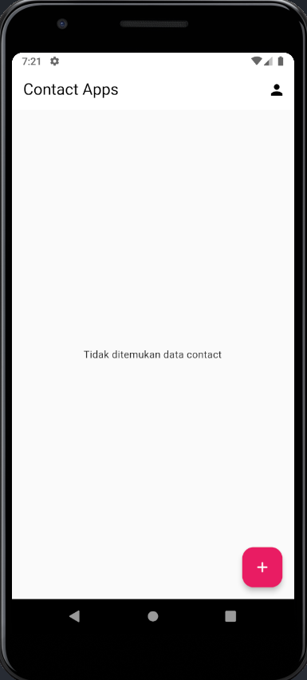
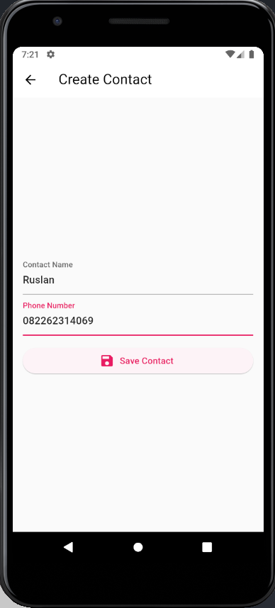
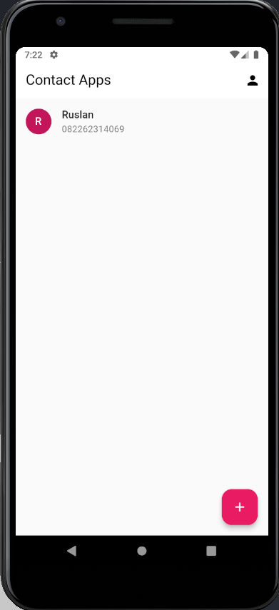
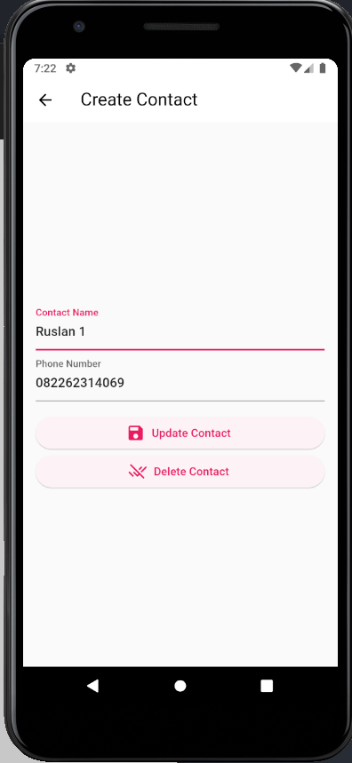
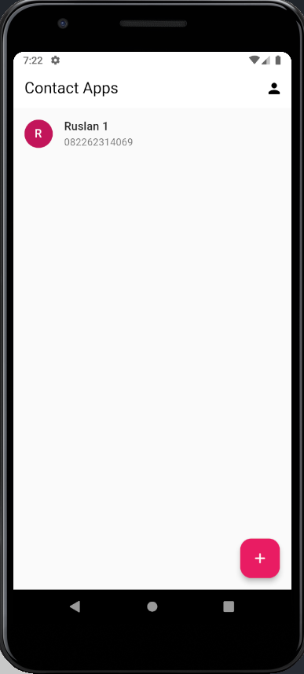
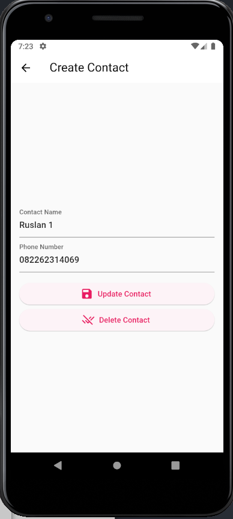
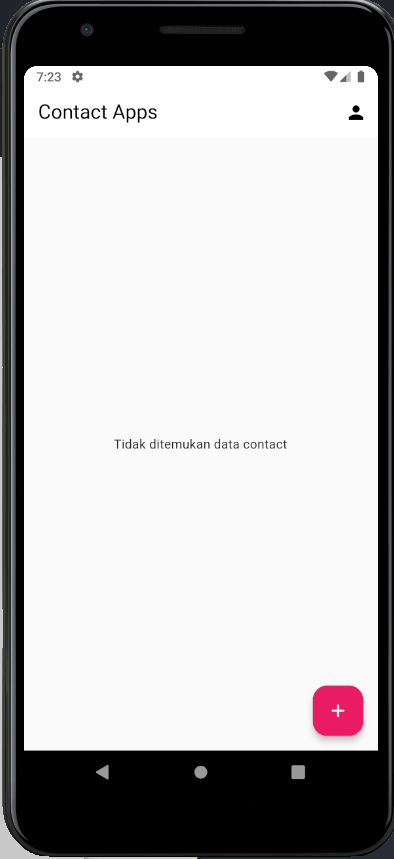
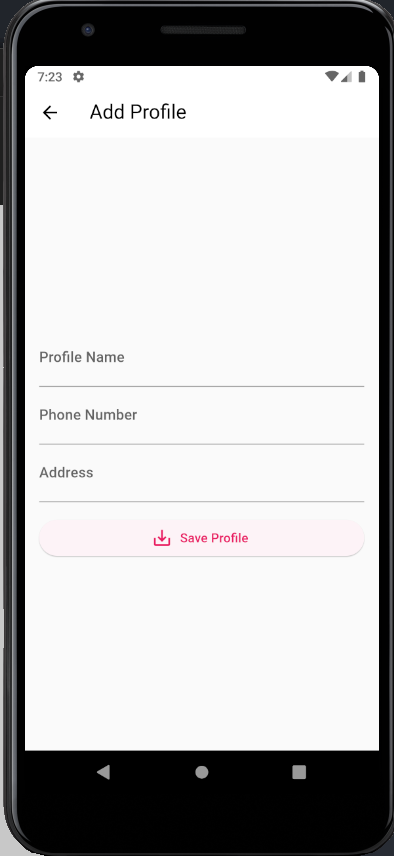
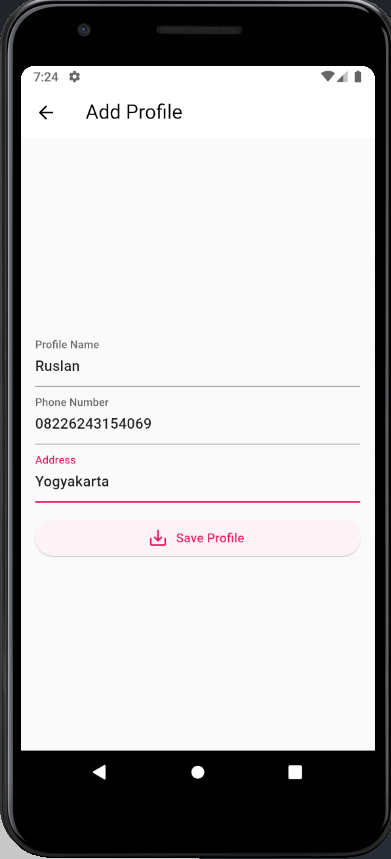
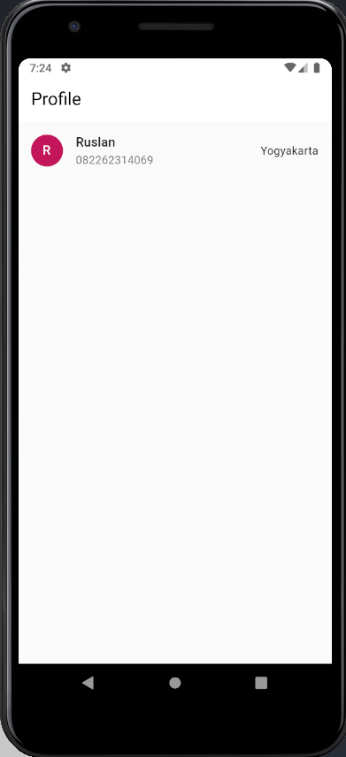

# (22) Flutter State Management (BLoC)

## Data Diri

Nomor Urut : 1_023FLB_52
Nama : Ruslan

## Task 01

- Dependencies
  Berikut package yang digunakan dalam project ini

```
dependencies:
  flutter:
    sdk: flutter
  cupertino_icons: ^1.0.2
  flutter_bloc: ^8.1.1
  nanoid: ^1.0.0
  equatable: ^2.0.5
```

- Model (contact model (contact.dart))

```
class Contact {
  final String id;
  final String name;
  final String phone;

  Contact({
    required this.id,
    required this.name,
    required this.phone,
  });
}
```

Pada contact model sayamembuat sebuah class Contact dengan properti id, name dan phon dan membuat constructor dari class model tersebut.

- ViewModel (BLoC)

  - event (contact_event.dart)

  ```
  part of 'contact_bloc.dart';

  abstract class ContactEvent extends Equatable {
      const ContactEvent();

      @override
      List<Object> get props => [];
  }

  class SaveContact extends ContactEvent {
      final Contact contact;
      const SaveContact(this.contact);
  }

  class UpdateContact extends ContactEvent {
      final Contact contact;
      const UpdateContact(this.contact);
  }

  class DeleteContact extends ContactEvent {
      final String id;
      const DeleteContact(this.id);
  }

  class Reload extends ContactEvent {}

  ```

  Pada bagian event saya membuat 4 buat event yaitu SaveContact untuk menyimpan kontak, UpdateContact untuk mengedit kontak, DeleteContact untuk menghapus kontak dan reload unutk proses yang membutuhkan waktu.

  - State (contact_state.dart)

  ```
  part of 'contact_bloc.dart';

  abstract class ContactState extends Equatable {
      final List<Contact> contacts;
      const ContactState(this.contacts);

       @override
       List<Object> get props => [contacts];
  }

  class Initial extends ContactState {
      const Initial(super.contacts);
  }

  class Loading extends ContactState {
      const Loading(super.contacts);
  }

  class Loaded extends ContactState {
      const Loaded(super.contacts);
  }

  class Failed extends ContactState {
      const Failed(super.contacts);
  }

  ```

  pada state saya membuat sebuah list dengan nama contacts yang diambil dari model dan membuat 4 buah state Initial, Loading, Loaded dan Failed.

  - Bloc (contact_bloc.dart)

  ```
  import 'package:bloc/bloc.dart';
  import 'package:contact/models/contact.dart';
  import 'package:equatable/equatable.dart';
  import 'package:collection/collection.dart';

  part 'contact_event.dart';
  part 'contact_state.dart';

  class ContactBloc extends Bloc<ContactEvent, ContactState> {
    ContactBloc() : super(const Initial([])) {
      on<SaveContact>((event, emit) async {
        // SET STATE LOADING
        emit(Loading(state.contacts));
        await Future.delayed(const Duration(seconds: 2));


        final existingContact = state.contacts
            .firstWhereOrNull((element) => element.phone == event.contact.phone);


        if (existingContact == null) {
          var existingContacts = [...state.contacts];
          existingContacts.add(event.contact);
          emit(Loaded(existingContacts));
        } else {
          emit(Failed(state.contacts));
        }
      });

      on<Reload>((event, emit) async {
        emit(Loading(state.contacts));
        await Future.delayed(const Duration(seconds: 1));
        emit(Initial(state.contacts));
      });

      on<UpdateContact>((event, emit) async {
        emit(Loading(state.contacts));
        await Future.delayed(const Duration(seconds: 1));

        final existingContactIndex = state.contacts
            .indexWhere((element) => element.id == event.contact.id);

        if (existingContactIndex != -1) {
          var existingContacts = [...state.contacts];
          existingContacts[existingContactIndex] = event.contact;
          emit(Loaded(existingContacts));
        } else {
          emit(Failed(state.contacts));
        }
      });

      on<DeleteContact>((event, emit) async {
        emit(Loading(state.contacts));
        await Future.delayed(const Duration(seconds: 1));

        final existingContactIndex =
            state.contacts.indexWhere((element) => element.id == event.id);

        if (existingContactIndex != -1) {
          var existingContacts = [...state.contacts];
          existingContacts.removeAt(existingContactIndex);
          emit(Loaded(existingContacts));
        } else {
          emit(Failed(state.contacts));
        }
      });
    }
  }

  ```

  Pada bagian bloc berisi perintah atau action dari event yang berisi on SaveContact untuk menyimpan kontak dari form, on UpdateContact untuk melakukan update contantact yang sudah ada dan on DeleteContact untuk menghapus kontak yang sduah ada

- View / Screen

  - Widget List Data (contact_list.dart)

  ```
  import 'package:contact/view_models/contact/contact_bloc.dart';
  import 'package:contact/views/screens/entry_contact_screen.dart';
  import 'package:flutter/material.dart';
  import 'package:flutter_bloc/flutter_bloc.dart';

  class ContactList extends StatelessWidget {
    const ContactList({super.key});

    @override
    Widget build(BuildContext context) {
      return BlocBuilder<ContactBloc, ContactState>(
        builder: (context, state) {
          if (state is Loading) {
            return const Center(child: CircularProgressIndicator());
          } else if (state is Failed) {
            return Center(
              child: Column(
                mainAxisAlignment: MainAxisAlignment.center,
                children: [
                  const Text('Gagal memroses data contact'),
                  ElevatedButton(
                    onPressed: () {
                      context.read<ContactBloc>().add(Reload());
                    },
                    child: const Text('Reload Contact'),
                  ),
                ],
              ),
            );
          }

          if (state.contacts.isNotEmpty) {
            return ListView.separated(
              itemBuilder: (context, index) {
                final contact = state.contacts[index];
                return ListTile(
                  leading: CircleAvatar(
                    child: Text(contact.name[0]),
                  ),
                  title: Text(contact.name),
                  subtitle: Text(contact.phone),
                  onLongPress: () {
                    Navigator.pushNamed(context, EntryContactScreen.routeName,
                        arguments: contact);
                  },
                );
              },
              separatorBuilder: (BuildContext context, int index) =>
                  const Divider(),
              itemCount: state.contacts.length,
            );
          } else {
            return const Center(child: Text("Tidak ditemukan data contact"));
          }
        },
      );
    }
  }

  ```

  Pada widget ini saya mereturn sebuah BlocBuilder yang dimana jika state dari bloc tersebut adalah Loading maka akan mereturn CircularProgressIndicator dan jika state Failed akan mereturn sebuah colum dengan test dan dengan elevated button yang memnggil state Reload dan data dari list kontak disimpa kedalam sebauh listview separated

  - Screen Entry Contact (entry_contact_screen.dart)

  ```
  import 'package:contact/view_models/contact/contact_bloc.dart';

  import 'package:contact/models/contact.dart';
  import 'package:flutter/material.dart';
  import 'package:flutter_bloc/flutter_bloc.dart';
  import 'package:nanoid/non_secure.dart';

  class EntryContactScreen extends StatefulWidget {
    static const routeName = "/contacts/entry";
    const EntryContactScreen({super.key});

    @override
    State<EntryContactScreen> createState() => _EntryContactScreenState();
  }

  class _EntryContactScreenState extends State<EntryContactScreen> {
    final _formKey = GlobalKey<FormState>();

    TextEditingController _ctrlName = TextEditingController();
    TextEditingController _ctrlPhone = TextEditingController();

    var _contactData = {'name': '', 'phone': ''};
    String? _existingContactId;

    @override
    Widget build(BuildContext context) {
      final argContact = ModalRoute.of(context)!.settings.arguments as Contact?;
      if (argContact != null) {
        _ctrlName.text = argContact.name;
        _ctrlPhone.text = argContact.phone;
        _existingContactId = argContact.id;
      }
      return Scaffold(
        appBar: AppBar(
          title: const Text("Create Contact"),
        ),
        body: Center(
          child: Padding(
            padding: const EdgeInsets.all(16),
            child: SingleChildScrollView(
              child: Form(
                key: _formKey,
                child: Column(
                  crossAxisAlignment: CrossAxisAlignment.stretch,
                  children: [
                    TextFormField(
                      controller: _ctrlName,
                      decoration: const InputDecoration(
                        label: Text("Contact Name"),
                      ),
                      validator: (value) {
                        if (value == null || value.isEmpty) {
                          return 'Nama tidak boleh kosong';
                        }
                        return null;
                      },
                      onSaved: (newValue) {
                        _contactData['name'] = newValue!;
                      },
                    ),
                    TextFormField(
                      controller: _ctrlPhone,
                      decoration: const InputDecoration(
                        label: Text("Phone Number"),
                      ),
                      validator: (value) {
                        if (value == null || value.isEmpty) {
                          return 'No Telp tidak boleh kosong';
                        }
                        return null;
                      },
                      onSaved: (newValue) {
                        _contactData['phone'] = newValue!;
                      },
                    ),
                    const SizedBox(height: 16),
                    ElevatedButton.icon(
                      onPressed: () {
                        if (_formKey.currentState!.validate()) {
                          _formKey.currentState!.save();
                          final newContact = Contact(
                            id: _existingContactId ?? nanoid(10),
                            name: _contactData['name'].toString(),
                            phone: _contactData['phone'].toString(),
                          );

                          if (_existingContactId != null) {
                            context
                                .read<ContactBloc>()
                                .add(UpdateContact(newContact));
                          } else {
                            context
                                .read<ContactBloc>()
                                .add(SaveContact(newContact));
                          }
                          Navigator.of(context).pop();
                        }
                      },
                      icon: const Icon(Icons.save),
                      label: Text(
                        _existingContactId == null
                            ? 'Save Contact'
                            : 'Update Contact',
                      ),
                    ),
                    if (_existingContactId != null)
                      ElevatedButton.icon(
                        onPressed: () {
                          context
                              .read<ContactBloc>()
                              .add(DeleteContact(_existingContactId!));
                          Navigator.pop(context);
                        },
                        icon: const Icon(Icons.remove_done),
                        label: const Text("Delete Contact"),
                      )
                  ],
                ),
              ),
            ),
          ),
        ),
      );
    }
  }

  ```

  Pada halaman add contact saya membuat form dengan 2 buah TextFormField nama dan nomor telepon yang dimana kedua TextFormField sudah memliki controller untuk mengambil data dari list data yang ada untuk keperuan update yang dibungkus kedalam sebuah SingleChildScrollView. dan sebuah elevated button untuk melakukan save dan update.

  - Home Page (contact_screen.dart)

  ```
  import 'package:contact/views/screens/entry_contact_screen.dart';
  import 'package:contact/views/screens/entry_profile.dart';
  import 'package:contact/views/widgets/contact_list.dart';
  import 'package:flutter/material.dart';

  class HomeScreen extends StatefulWidget {
    static const rotuteName = '/contacts';
    const HomeScreen({super.key});

    @override
    State<HomeScreen> createState() => _HomeScreenState();
  }

  class _HomeScreenState extends State<HomeScreen> {
    @override
    Widget build(BuildContext context) {
      return Scaffold(
        appBar: AppBar(
          title: const Text("Contact Apps"),
          actions: [
            IconButton(
              onPressed: () =>
                  Navigator.pushNamed(context, EntryProfile.routeName),

              icon: const Icon(Icons.person),
            ),
          ],
        ),
        body: const ContactList(),
        floatingActionButton: FloatingActionButton(
          onPressed: () {
            Navigator.pushNamed(context, EntryContactScreen.routeName);
          },
          child: const Icon(Icons.add_rounded),
        ),
      );
    }
  }

  ```

  pada halaman home page saya membuats page dengam body mengambil list dari contact dan juga sebuah icon button di app bar untuk membuat profile.

  - Main Screen (main.dart)

  ```
  import 'package:contact/view_models/contact/contact_bloc.dart';
  import 'package:contact/view_models/profile/profile_bloc.dart';
  import 'package:contact/views/screens/contact_screen.dart';
  import 'package:contact/views/screens/entry_contact_screen.dart';
  import 'package:contact/views/screens/entry_profile.dart';
  import 'package:contact/views/screens/profile.dart';
  import 'package:flutter/material.dart';
  import 'package:flutter_bloc/flutter_bloc.dart';

  void main() {
    runApp(const MyApp());
  }

  class MyApp extends StatelessWidget {
    const MyApp({super.key});

    @override
    Widget build(BuildContext context) {
      return MultiBlocProvider(
        providers: [
          BlocProvider<ContactBloc>(
            create: (context) => ContactBloc(),
          ),
          BlocProvider<ProfileBloc>(
            create: (context) => ProfileBloc(),
          ),
        ],
        child: MaterialApp(
          debugShowCheckedModeBanner: false,
          theme: ThemeData(
            primarySwatch: Colors.pink,
            useMaterial3: true,
          ),
          initialRoute: HomeScreen.rotuteName,
          routes: {
            HomeScreen.rotuteName: (context) => const HomeScreen(),
            EntryContactScreen.routeName: (context) => const EntryContactScreen(),
            EntryProfile.routeName: (context) => const EntryProfile(),
            ProfileScreen.routeName: (context) => const ProfileScreen(),
          },
        ),
      );
    }
  }

  ```

  pada halaman main berisi route yang didaftarkan dan dengan initialroute dari rout HomeScreen.

  ### task 02 (Membuat profile bloc).

- Model

```
class Profile {
  final String name;
  final String phone;
  final String address;

  Profile({
    required this.name,
    required this.phone,
    required this.address,
  });
}
```

Pada model profile saya membuat 3 buah properti yaitu name, phone dan address.

- event (profile_event.dart)

```
part of 'profile_bloc.dart';

abstract class ProfileEvent extends Equatable {
  const ProfileEvent();

  @override
  List<Object> get props => [];
}

class SaveProfile extends ProfileEvent {
  final Profile profile;
  const SaveProfile(this.profile);
}

```

pada event saya hanya membuat 1 event SaveProfile untuk menyimpan profile.

- State (profile_statte.dart)

```
part of 'profile_bloc.dart';

abstract class ProfileState extends Equatable {
  final List<Profile> profiles;
  const ProfileState(this.profiles);

  @override
  List<Object> get props => [];
}

class Initial extends ProfileState {
  const Initial(super.contacts);
}

```

Dan juga pada satte saya hamnya membuat state initial

- bloc (profile_bloc.dart)

```
import 'package:bloc/bloc.dart';
import 'package:contact/models/profile.dart';
import 'package:equatable/equatable.dart';

part 'profile_event.dart';
part 'profile_state.dart';

class ProfileBloc extends Bloc<ProfileEvent, ProfileState> {
  ProfileBloc() : super(Initial([])) {
    on<SaveProfile>((event, emit) async {
      var existingProfile = [...state.profiles];

      existingProfile.add(event.profile);
      emit(Initial(existingProfile));
    });
  }
}

```

Dan pada bloc saya hanya membuat satuproses yaitu proses menyimpan data profile.

- Page entry profile (entry_profile.dart)

```
...

class EntryProfile extends StatefulWidget {
  static const routeName = '/profile';
  const EntryProfile({super.key});

  @override
  State<EntryProfile> createState() => _EntryProfileState();
}

class _EntryProfileState extends State<EntryProfile> {
  final _formKey = GlobalKey<FormState>();

  var _contactProfile = {'name': '', 'phone': '', 'address': ''};

  @override
  Widget build(BuildContext context) {
    final argProfile = ModalRoute.of(context)!.settings.arguments as Profile?;
    return Scaffold(
      appBar: AppBar(
        title: const Text("Add Profile"),
      ),
      body: Center(
        child: Padding(
          padding: const EdgeInsets.all(16),
          child: SingleChildScrollView(
            child: Form(
              key: _formKey,
              child: Column(
                crossAxisAlignment: CrossAxisAlignment.stretch,
                children: [
                  TextFormField(
                    decoration: const InputDecoration(
                      label: Text("Profile Name"),
                    ),
                    validator: (value) {
                      if (value == null || value.isEmpty) {
                        return 'Nama tidak boleh kosong';
                      }
                      return null;
                    },
                    onSaved: (newValue) {
                      _contactProfile['name'] = newValue!;
                    },
                  ),
                  TextFormField(
                    decoration: const InputDecoration(
                      label: Text("Phone Number"),
                    ),
                    validator: (value) {
                      if (value == null || value.isEmpty) {
                        return 'No Telp tidak boleh kosong';
                      }
                      return null;
                    },
                    onSaved: (newValue) {
                      _contactProfile['phone'] = newValue!;
                    },
                  ),
                  TextFormField(
                    decoration: const InputDecoration(
                      label: Text("Address"),
                    ),
                    validator: (value) {
                      if (value == null || value.isEmpty) {
                        return 'Alamat tidak boleh kosong';
                      }
                      return null;
                    },
                    onSaved: (newValue) {
                      _contactProfile['address'] = newValue!;
                    },
                  ),
                  const SizedBox(height: 16),
                  ElevatedButton.icon(
                    onPressed: () {
                      if (_formKey.currentState!.validate()) {
                        _formKey.currentState!.save();
                        final newprofile = Profile(
                          name: _contactProfile['name'].toString(),
                          phone: _contactProfile['phone'].toString(),
                          address: _contactProfile['address'].toString(),
                        );
                        context
                            .read<ProfileBloc>()
                            .add(SaveProfile(newprofile));
                        Navigator.pushNamed(context, ProfileScreen.routeName,
                            arguments: argProfile);
                      }
                    },
                    icon: const Icon(Icons.save_alt),
                    label: const Text("Save Profile"),
                  ),
                ],
              ),
            ),
          ),
        ),
      ),
    );
  }
}

```

Pada halaman entry profile saya membuat form dengan 3 buah TextFormField dari name, phone dan address dan sebuah ElevatedButton unutk menyimpan data tersebut yang dikririm ke halaman profile.

- Profile Page (profile.dart)

```
..

class ProfileScreen extends StatefulWidget {
  static const routeName = '/profile/screen';
  const ProfileScreen({super.key});

  @override
  State<ProfileScreen> createState() => _ProfileScreenState();
}

class _ProfileScreenState extends State<ProfileScreen> {
  @override
  Widget build(BuildContext context) {
    return MaterialApp(
      debugShowCheckedModeBanner: false,
      theme: ThemeData(
        primarySwatch: Colors.pink,
        useMaterial3: true,
      ),
      home: Scaffold(
          appBar: AppBar(
            title: Text("Profile"),
          ),
          body: BlocBuilder<ProfileBloc, ProfileState>(
            builder: (context, state) {
              return ListView.separated(
                itemBuilder: (context, index) {
                  final profile = state.profiles[index];
                  return ListTile(
                    leading: CircleAvatar(
                      child: Text(profile.name[0]),
                    ),
                    title: Text(profile.name),
                    subtitle: Text(profile.phone),
                    trailing: Text(profile.address),
                  );
                },
                separatorBuilder: (BuildContext context, int index) =>
                    const Divider(),
                itemCount: state.profiles.length,
              );
            },
          )),
    );
  }
}

```

Pada profile screen saya membuat ListView.separate yang dibungkus kedalam BlocBuilder yang dimana di ListView menyimpan data dari yang dikirimkan dari halaman entry profile.

- Hasil
  Berikut hasil dari program diatas
  
  
  
  Ketika tombol add di tekan makan akan muncul form untuk menambah kontak dan jika jika tombol save contact di tekan maka data contact berhasil di buat dan jika di long press maka akan membuka halaman edit contact dan jika memlih delete maka akan menghapus data contact
  
  
  
  
  
  Jika icon profile di appbar di klik makan aman membuka halaman add profile
  
  
  
