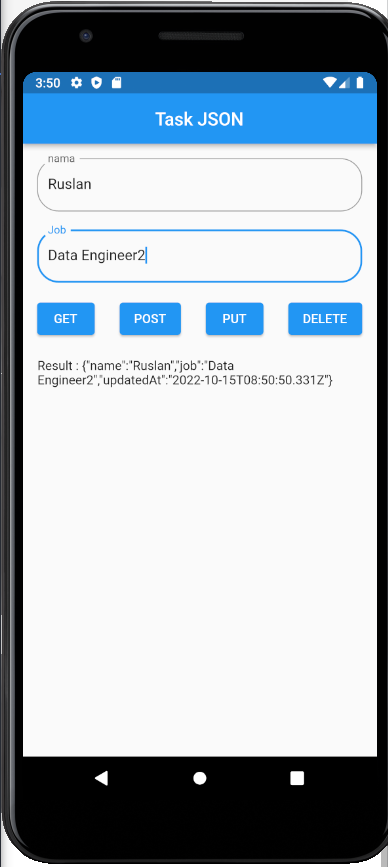

# (24) Introduction REST API – JSON serialization/deserialization

## Data Diri

Nomor Urut : 1_023FLB_52
Nama : Ruslan

## Task

### Task 01

- HomePage (home_page.dart)

```
import 'dart:convert';
import 'package:dio/dio.dart';
import 'package:flutter/material.dart';

class HomePage extends StatefulWidget {
  ...
}

class _HomePageState extends State<HomePage> {
  final formKey = GlobalKey<FormState>();
  final TextEditingController _controllerName = TextEditingController();
  final TextEditingController _controllerJob = TextEditingController();

  var result = "";
  final baseUrl = "https://reqres.in/api/users";

  getData() async {
    var dio = Dio();
    var res = await dio.get(baseUrl);

    result = jsonEncode(res.data);
  }

  postData() async {
    var dio = Dio();

    var dataMap = {
      'name': _controllerName.text,
      'job': _controllerJob.text,
    };

    final res = await dio.post(baseUrl, data: dataMap);

    result = jsonEncode(res.data);
  }

  putData() async {
    var dio = Dio();

    var dataMap = {
      'name': _controllerName.text,
      'job': _controllerJob.text,
    };

    final res = await dio.put("$baseUrl/4", data: dataMap);

    result = jsonEncode(res.data);
  }

  deleteData() async {
    var dio = Dio();
    var res = await dio.delete("$baseUrl/4");

    result = jsonEncode(res.data);
  }

  @override
  Widget build(BuildContext context) {
    return Scaffold(
      ...
    );
  }
}
```

Pada mhome page di bagian state saya membuat sebuah fomkey dengan global key untuk key dari form yang akan dibuat di bagian ui dan 2 buah controller untuk text field yaitu \_controllerName dan_controllerJob. dan sebuah variabel result dengan nilai awal kosong dan juga sebuah variabel dengan nama baseUrl yang berisi link API yang akan digunakan. selain itu saya membuat 4 buah method :

- getData
  pada method getData dengan async await diamana saya membuat sebuah variabel res dengan value isi dari dari dari API tersebut dengna mengunakan dio.get dimana sebelumnya saya sudah menginstall package dio terlebih dahulu. selah itu saya menginisialisasi nilai dari variabel result sebelumnya dengan nilai dari variabel res denganan mengunanak jsinEndcode dengan dart:convert

- postData
  Pada method postData saya membuat sebuah variabel dio dengan nilai Dio() dari package dio, lalu saya membuat sebuah map dengan nama dataMap dengan key nama dan job dan value \_controllerName dan_controllerJob yang sebelumnya sudah dibuat, setelah itu saya membuat sebuah variabel res dengan value dio.put dengan mengambil API dengan id 4 dan dengan data: dataMap atau map yang sebelumnya dibuat. selah itu saya menginisialisasi nilai dari variabel result sebelumnya dengan nilai dari variabel res denganan mengunanak jsinEndcode dengan dart:convert

- putData
  Pada method putData sama seperti method postData hanya saya mengganti comand dio.post menjadi dio.get untuk data dan variabel nya saya buat sama karena hasil copy dari method getData.

- deleteData
  Pada bagian method delete data saya buat sama seperti method getData namun pada bagian dio.get saya ganti menjadi dio.delete dan pada parameter baseUrl saya menambahkan angka /4 di bagian belakang baseUrl yang artinya menghapus data dengan id 4.

```
class HomePage extends StatefulWidget {
  ...
}

class _HomePageState extends State<HomePage> {
  ...

  @override
  Widget build(BuildContext context) {
    return Scaffold(
      appBar: AppBar(
        title: const Text("Task JSON"),
        centerTitle: true,
      ),
      body: SingleChildScrollView(
        child: Padding(
          padding: const EdgeInsets.all(16),
          child: Center(
            child: Form(
              key: formKey,
              child: Column(
                children: [
                  TextFormField(
                    decoration: const InputDecoration(
                      label: Text("nama"),
                      hintText: "Input Name",
                      border: OutlineInputBorder(
                        borderRadius: BorderRadius.all(Radius.circular(24)),
                      ),
                    ),
                    validator: (value) {
                      if (value == null || value.length < 10) {
                        return 'Please input a valid name';
                      }
                      return null;
                    },
                    keyboardType: TextInputType.phone,
                    textInputAction: TextInputAction.next,
                    controller: _controllerName,
                  ),
                  const SizedBox(height: 20),
                  TextFormField(
                    decoration: const InputDecoration(
                      label: Text("Job"),
                      hintText: "Input Job",
                      border: OutlineInputBorder(
                        borderRadius: BorderRadius.all(Radius.circular(24)),
                      ),
                    ),
                    validator: (value) {
                      if (value == null || value.length < 10) {
                        return 'Please input a valid job';
                      }
                      return null;
                    },
                    keyboardType: TextInputType.name,
                    textInputAction: TextInputAction.next,
                    controller: _controllerJob,
                  ),
                  const SizedBox(height: 16),
                  Row(
                    mainAxisAlignment: MainAxisAlignment.spaceBetween,
                    children: [
                      ElevatedButton(
                        onPressed: () {
                          setState(() {
                            getData();
                          });
                        },
                        child: const Text("GET"),
                      ),
                      ElevatedButton(
                        onPressed: () {
                          setState(() {
                            postData();
                          });
                        },
                        child: const Text("POST"),
                      ),
                      ElevatedButton(
                        onPressed: () {
                          setState(() {
                            putData();
                          });
                        },
                        child: const Text("PUT"),
                      ),
                      ElevatedButton(
                        onPressed: () {
                          setState(() {
                            deleteData();
                          });
                        },
                        child: const Text("DELETE"),
                      ),
                    ],
                  ),
                  const SizedBox(height: 20),
                  Text("Result : $result")
                ],
              ),
            ),
          ),
        ),
      ),
    );
  }
}

```

Pada bagian build saya hanya membuat tampilan sederhana dengan appBar "Task JSON" dengan body padding dengan child center dan child dari center tersebut mereturn sebuah form dengan key variabel formKey yang sebelumnya dibuat. dan pada form saya membuat dua buah text field dengan input nama dan job dan 4 buah elevated button yang di bungkus kedalam widget row. pada button get saya memanggil method getData di bagian setSate yang sebelumnya sudah dibuat, pada button post saya memanggil method postData di bagian setSate, pada button put saya memanggil method putData di bagian setSate dan pada button delete saya memanggil method deleteData di bagian setSate.

- Main page (main.dart)

```
class _MyAppState extends State<MyApp> {
  @override
  Widget build(BuildContext context) {
    return const MaterialApp(
      debugShowCheckedModeBanner: false,
      home: HomePage(),
    );
  }
}
```

Seperti biasa pada main page saya mereturn material dengan home memamnggil halaman HomePage().

- Hasil
  
  
  
  
  

  ***

###Task 02

- model (data.dart)

```
class DataAPI {
  late String email;
  late String firstName;
  late String lastName;
  late String avatar;

  DataAPI({
    required this.email,
    required this.firstName,
    required this.lastName,
    required this.avatar,
  });
}

```

Pada model saya membuat sebuah class dengan property email, firstName, lastName dan avatar kemudian membuat constructor dari class model tersebut.

- Home Page (home_page.dart)

```
import 'package:flutter/material.dart';
import 'package:dio/dio.dart';

class HomePage extends StatefulWidget {
  ...
}

class _HomePageState extends State<HomePage> {
  String response = '';
  List<Map<String, dynamic>> _listDataMap = [];

  @override
  Widget build(BuildContext context) {
    return Scaffold(
      appBar: AppBar(
        title: const Text(
          'Task Example',
          style: TextStyle(color: Colors.white),
        ),
        centerTitle: true,
      ),
      body: Padding(
        padding: const EdgeInsets.all(16),
        child: Column(
          crossAxisAlignment: CrossAxisAlignment.stretch,
          children: [
            ElevatedButton(
              onPressed: () async {
                final dio = Dio();
                final baseUrl = "https://reqres.in/api/users";
                final res = await dio.get(baseUrl);

                final listMap = List<Map<String, dynamic>>.from(
                  res.data['data'].map(
                    (dataApi) => {
                      'email': dataApi['email'].toString(),
                      'firstName': dataApi['first_name'].toString(),
                      'lastName': dataApi['last_name'].toString(),
                      'avatar': dataApi['avatar'].toString(),
                    },
                  ),
                );

                setState(() {
                  _listDataMap = listMap;
                });
              },
              child: const Text(
                'GET',
                style: TextStyle(color: Colors.white),
              ),
            ),
            const SizedBox(
              height: 16,
            ),
            Expanded(
              child: ListView.separated(
                itemBuilder: (context, index) {
                  final user = _listDataMap[index];
                  return ListTile(
                    leading: CircleAvatar(
                      child: Image.network(user['avatar']),
                    ),
                    title: Text(
                        '${user['firstName'].toString()} ${user['lastName'].toString()}'),
                    subtitle: Text(user['email']),
                  );
                },
                separatorBuilder: (context, index) => const Divider(),
                itemCount: _listDataMap.length,
              ),
            ),
          ],
        ),
      ),
    );
  }
}

```

Pada bagian home page pertama tama saya mengimport material dan package dio, kemudian saya membuat sebuah variabel kosong dengan nama response yang bertipe string, kemudian saya membuat sebuah list kosong dari map dengan nama \_listDataMap. dan pada bagaian body saya membuat sebuah ElevatedButton dengan child GET dan pada methon onPress saya mengambil data dari API dengan dio.get yang disimpan kedalam variabel res kemudian saya membuat sebuah variabel dengan nama listMap yang dimana value dari list tersebut diambil dari data dari API yang disimpan kedalam map pada pada setState mengisialisasikna nilai dari variabel \_listDataMap = listMap yang dimana data tersebut akan ditampilkan kedalam sebuah ListView separated

- Main Page (main.dart)

```
import 'package:flutter/material.dart';
import 'package:task_02/home_page.dart';

void main() {
  runApp(const MyApp());
}

class MyApp extends StatelessWidget {
  const MyApp({super.key});

  @override
  Widget build(BuildContext context) {
    return MaterialApp(
      debugShowCheckedModeBanner: false,
      title: 'Flutter Demo',
      theme: ThemeData(
        primarySwatch: Colors.grey,
      ),
      home: const HomePage(),
    );
  }
}

```

Pada main page saya menggunakan thema berwarna grey dan home dari main page tersebut adalah halaman HomePage sehingga saat aplikasi di jalanan akan menampilkan halaman HomePage.

- Hasil
  
  
