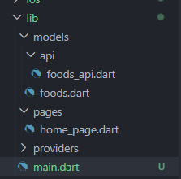
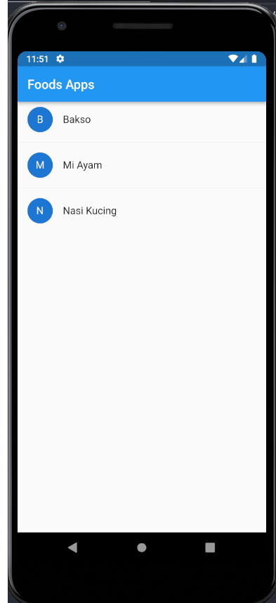
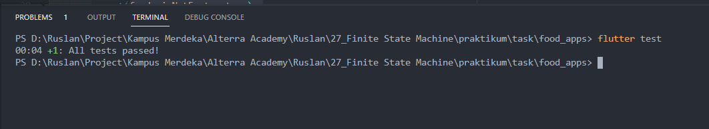

# (26) Finite State Machine

## Data Diri

Nomor Urut : 1_023FLB_52
Nama : Ruslan

##Task

- Struktur folder
  
- Dependencies

```
dev_dependencies:
  flutter_test:
    sdk: flutter
  test:
  mockito:
  build_runner:
```

Diatas adalah package yang digunakan namun hanya di dev_dependencies

- Model (foods.dart)

```
class Foods {
  final int id;
  final String name;

  Foods({
    required this.id,
    required this.name,
  });
}

```

Pertama tama saya membuat model dengan nama Foods dengan required id dan nama.

- API (foods_api.dart)

```
class FoodsAPI {
  static Future<List<Foods>> getDataFoods() async {
    final response = await Dio().get(
        "https://my-json-server.typicode.com/hadihammurabi/flutter-webservice/foods");

    List<Foods> foods = (response.data as List)
        .map(
          (e) => Foods(
            id: e['id'],
            name: e['name'],
          ),
        )
        .toList();
    return foods;
  }
}
```

Saya membat class dengan nama FoodsAPI yang mengambil data dari API dengan menggunakan dio yang dimana data tersebut disimpan kedalam map lalu di konversi ke list.

- View Model / Provider (doods_provider.dart)

```
class FoodsProvider with ChangeNotifier {
  List<Foods> _foods = [];
  List<Foods> get foods => [..._foods];

  getAllFoods() async {
    final f = await FoodsAPI.getDataFoods();
    _foods = f;
    notifyListeners();
  }
}
```

Kemudian saya membuat sebuah provider dengan class FoodsProvider dengan ChangeNotifier yang didalam nya saya membuat sebuah list kosong dengan nama \_foods yang diambil dari model Foods dan kemudian saya membuat getter dari list tersebut. dan pada provider ini saya membuat sebuah method untuk mengambil data makanan yang ada di api.

- Home Page (home_page.dart)

```
class HomePage extends StatefulWidget {
...
}

class _HomePageState extends State<HomePage> {
  @override
  void didChangeDependencies() {
    super.didChangeDependencies();
    WidgetsBinding.instance.addPostFrameCallback((timeStamp) {
      Provider.of<FoodsProvider>(context, listen: false).getAllFoods();
    });
  }

  @override
  Widget build(BuildContext context) {
    final modelView = Provider.of<FoodsProvider>(context);
    return Scaffold(
      appBar: AppBar(
        title: const Text("Foods Apps"),
      ),
      body: ListView.separated(
        itemBuilder: (context, index) {
          final food = modelView.foods[index];
          return ListTile(
            leading: CircleAvatar(
              child: Text(food.name[0]),
            ),
            title: Text(food.name),
          );
        },
        itemCount: modelView.foods.length,
        separatorBuilder: (BuildContext context, int index) => const Divider(),
      ),
    );
  }
}
```

Pada halaman home page saya memanggil fungction didChangeDependencies dengan callback memanggil method getAllFoods dari provider.

- main page (main.dart)

```
void main() {
  runApp(
    MultiProvider(providers: [
      ChangeNotifierProvider(
        create: (_) => FoodsProvider(),
      )
    ], child: const MyApp()),
  );
}

class MyApp extends StatelessWidget {
  const MyApp({super.key});

  @override
  Widget build(BuildContext context) {
    return const MaterialApp(
      debugShowCheckedModeBanner: false,
      home: HomePage(),
    );
  }
}
```

Pada main page saya mendaftarkan provider yang sudah dibuat sebelumnya pada runApp dan pada bagian home memanggil home page.

- Hasil Apps
  Berikut adalah hasil dari get data dari api
  

### Implementasi unit testing dengan mocking

- menghapus static pada class FoodsAPI di bagian Future

```
class FoodsAPI {
  Future<List<Foods>> getDataFoods() async {
    final response = await Dio().get(
        "https://my-json-server.typicode.com/hadihammurabi/flutter-webservice/foods");

    List<Foods> foods = (response.data as List)
        .map(
          (e) => Foods(
            id: e['id'],
            name: e['name'],
          ),
        )
        .toList();
    return foods;
  }
}
```

- membuat file test

```
import 'package:flutter_test/flutter_test.dart';
import 'package:food_apps/models/foods.dart';
import 'package:food_apps/models/api/foods_api.dart';
import 'package:mockito/mockito.dart';
import 'package:mockito/annotations.dart';
import 'foods_api_test.mocks.dart';

@GenerateMocks([FoodsAPI])
...
}

```

menggunakan comand @GenerateMocks([FoodsAPI]) lalu mengetikan cummand "flutter pub run build_runner build untuk membuat file mocking secara otomatis"

```
import 'package:flutter_test/flutter_test.dart';
import 'package:food_apps/models/foods.dart';
import 'package:food_apps/models/api/foods_api.dart';
import 'package:mockito/mockito.dart';
import 'package:mockito/annotations.dart';
import 'foods_api_test.mocks.dart';

@GenerateMocks([FoodsAPI])
void main() {
  group(
    'Contact API Test',
    () {
      FoodsAPI foodsApi = MockFoodsAPI();
      test('get all foods returns data', () async {
        when(foodsApi.getDataFoods()).thenAnswer((_) async => <Foods>[
              Foods(id: 1, name: "Ruslan"),
            ]);

        var foods = await foodsApi.getDataFoods();
        expect(foods.isNotEmpty, true);
      });
    },
  );
}

```

memanggal class MockFoodsAPI dari file mocking yang sebelumnya digenerate secar otomatis laku membuat command testing dengan when untuk membuat objek tiruan dengnan mengisikan id dan nama dengan expec data foods tidak boleh kosong.

- hasil
  
