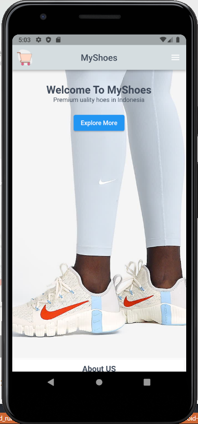
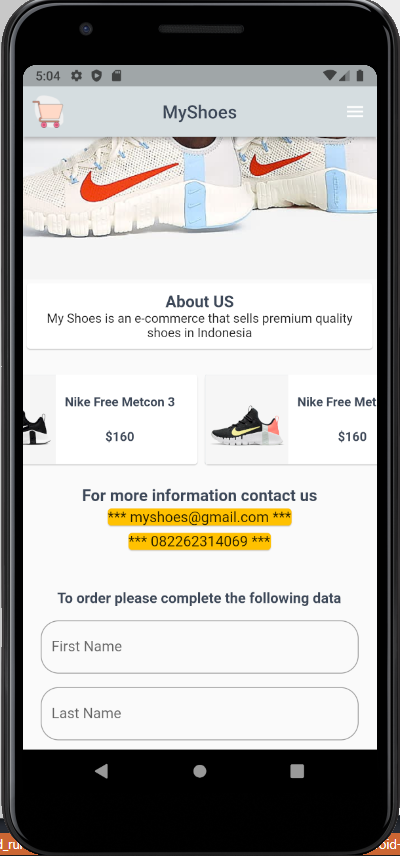
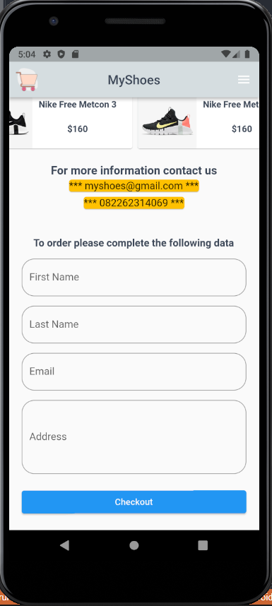
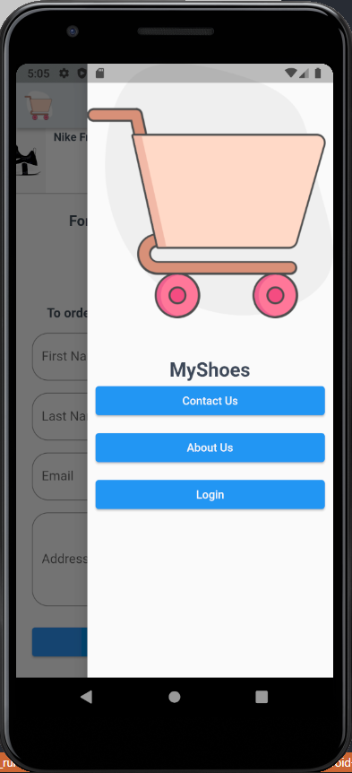

# Weekly2

## Data Diri

Nomor Urut : 1_023FLB_52
Nama : Ruslan

### - Custom Color

```
const Color whiteColor = Color(0xffF7F8F9);
const Color blueColor = Color(0xff1152FD);
const Color greyColor = Color(0xffD5DDE0);
const Color blackColor = Color(0xff3E4958);
```

Pada fie custom color saya menginisialisasikan semua carna yang akan digunakan

### - File Contact.dart

```
Widget build(BuildContext context) {
    return Padding(
      padding: const EdgeInsets.all(20),
      child: Column(
        children: const [
          Text(
            "For more information contact us",
            style: TextStyle(fontSize: 18, fontWeight: FontWeight.bold),
          ),
          Card(
            color: Colors.amber,
            child: Text(
              "*** myshoes@gmail.com ***",
              style: TextStyle(
                fontSize: 16,
              ),
            ),
          ),
          Card(
            color: Colors.amber,
            child: Text(
              "*** 082262314069 ***",
              style: TextStyle(
                fontSize: 16,
              ),
            ),
          ),
        ],
      ),
    );
  }
```

Pada file ini saya membuat sebuah padding dengan child column yang dimana cintentnnya terdapat text email dan no telp yang dibungkus kedalam card

### - File image.dart

```
Widget build(BuildContext context) {
    return Stack(
      children: [
        Image.asset("assets/images/image4.png"),
        Center(
          child: Column(
            children: [
              const SizedBox(height: 50),
              const Text(
                "Welcome To MyShoes",
                style: TextStyle(
                  fontSize: 24,
                  color: blackColor,
                  fontWeight: FontWeight.bold,
                ),
              ),
              const Text(
                "Premium uality hoes in Indonesia",
                style: TextStyle(color: blackColor),
              ),
              Padding(
                padding: const EdgeInsets.all(20),
                child: ElevatedButton(
                  onPressed: () {},
                  child: const Text(
                    "Explore More",
                    style: TextStyle(color: whiteColor),
                  ),
                ),
              )
            ],
          ),
        ),
      ],
    );
```

Pada file image.dart saya mereturn sebuah stack yang dimana didalam stack tersebut terdapat sebuah gambar yang menjadi backgroup dan sebuah widget text dan juga sebuah button

### - file form.dart

```
return Padding(
      padding: const EdgeInsets.all(20),
      child: Column(
        mainAxisAlignment: MainAxisAlignment.center,
        children: const [
          Text(
            "To order please complete the following data",
            style: TextStyle(fontSize: 16, fontWeight: FontWeight.bold),
          ),
          SizedBox(height: 15),
          TextField(
            keyboardType: TextInputType.text,
            decoration: InputDecoration(
              label: Text("First Name"),
              hintText: "First Name",
              border: OutlineInputBorder(
                borderRadius: BorderRadius.all(
                  Radius.circular(20),
                ),
              ),
            ),
          ),
          SizedBox(height: 15),
          TextField(
            keyboardType: TextInputType.text,
            decoration: InputDecoration(
              hintText: "Last Name",
              label: Text("Last Name"),
              border: OutlineInputBorder(
                borderRadius: BorderRadius.all(
                  Radius.circular(20),
                ),
              ),
            ),
          ),
          SizedBox(height: 15),
          TextField(
            keyboardType: TextInputType.emailAddress,
            decoration: InputDecoration(
              hintText: "Email",
              label: Text("Email"),
              border: OutlineInputBorder(
                borderRadius: BorderRadius.all(
                  Radius.circular(20),
                ),
              ),
            ),
          ),
          SizedBox(height: 15),
          TextField(
            keyboardType: TextInputType.multiline,
            maxLines: 4,
            decoration: InputDecoration(
              label: Text("Massage"),
              hintText: "Massage",
              border: OutlineInputBorder(
                borderRadius: BorderRadius.all(
                  Radius.circular(20),
                ),
              ),
            ),
          ),
        ],
      ),
    );
```

Pada file form ini saya mereturn sebuah padding dengan child column yang dimana terdapat sebuah text dan 3 buah textfield denga tipe inputan berbeda mulai dari text, email, dan multiline.

### - File About Us

```
Card(
    child: Padding(
      padding: const EdgeInsets.all(10),
      child: Column(
        children: const [
          Text(
            "About US",
            style: TextStyle(
              color: blackColor,
              fontSize: 18,
              fontWeight: FontWeight.bold,
            ),
          ),
          Text(
            "My Shoes is an e-commerce that sells premium quality shoes in Indonesia",
            textAlign: TextAlign.center,
          )
        ],
      ),
    ),
),
```

Pada file about us saya membuat sebuah card dengan child comlumn yang berisi 2 buah widget text.

### - Drawwer

```
return Drawer(
      child: Column(
        children: [
          Image.asset("assets/images/drawer.png"),
          const SizedBox(height: 50),
          const Text(
            "MyShoes",
            style: TextStyle(
              color: blackColor,
              fontWeight: FontWeight.bold,
              fontSize: 24,
            ),
          ),
          Column(
            mainAxisAlignment: MainAxisAlignment.spaceAround,
            children: [
              Padding(
                padding: const EdgeInsets.only(right: 10, left: 10, bottom: 10),
                child: Container(
                  width: double.infinity,
                  child: ElevatedButton(
                    onPressed: () {},
                    child: const Text(
                      "Contact Us",
                      style: TextStyle(color: whiteColor),
                    ),
                  ),
                ),
              ),
              Padding(
                padding: const EdgeInsets.only(right: 10, left: 10, bottom: 10),
                child: Container(
                  width: double.infinity,
                  child: ElevatedButton(
                    onPressed: () {},
                    child: const Text(
                      "About Us",
                      style: TextStyle(color: whiteColor),
                    ),
                  ),
                ),
              ),
              Padding(
                padding: const EdgeInsets.only(right: 10, left: 10, bottom: 10),
                child: Container(
                  width: double.infinity,
                  child: ElevatedButton(
                    onPressed: () {},
                    child: const Text(
                      "Login",
                      style: TextStyle(color: whiteColor),
                    ),
                  ),
                ),
              )
            ],
          )
        ],
      ),
    );
```

Pada darawer page saya membuat sebuah drawer dengan child colum yang memiliki childre 1 buah image dan 3 elevatedBottom.

### Product.dart

```
Card(
  child: Container(
    width: 250,
    height: 100,
    child: Row(
      children: [
        const Image(
          image: AssetImage("assets/images/shoes02.png"),
        ),
        SizedBox(width: 10),
        Column(
          mainAxisAlignment: MainAxisAlignment.spaceEvenly,
          children: const [
            Text(
              "Nike Free Metcon 3",
              style: TextStyle(
                  color: blackColor, fontWeight: FontWeight.bold),
            ),
            Text(
              "\$160",
              style: TextStyle(
                  color: blackColor, fontWeight: FontWeight.bold),
            ),
          ],
        ),
      ],
    ),
  ),
),
```

Pada file product saya membuat sebuah singleChildScrollView dengan croll direction horizontal yang memiliki children card dengan colontoh card seperti diatas yang memiliki iamge dan 2 buah text yaitu nama barang dan harga.

### - file main.dart

```
return MaterialApp(
  debugShowCheckedModeBanner: false,
  home: Scaffold(
    ...
    endDrawer: const DrawerPage(),
    body: Center(
      child: ListView(
        children: [
          const ImagePage(),
          const AboutUs(),
          const SizedBox(height: 20),
          const ProductPage(),
          const ContactPage(),
          const FormPage(),
          Padding(
            padding: const EdgeInsets.only(right: 20, bottom: 20, left: 20),
            child: Container(
              width: double.infinity,
              child: ElevatedButton(
                onPressed: () {},
                child: const Text(
                  "Checkout",
                  style: TextStyle(color: whiteColor),
                ),
              ),
            ),
          )
        ],
      ),
    ),
  ),
);
```

Pada main page saya membuat sebuah appBar yang berada di tengan dan sebuah image sebagai logo di sebelah kiri dengan leading dan sebuah endrawer yang memanggil page drawer agar drawwer nya berada di pojok kanan dan untuk body nya saya menggunakan list view dengan childern imagePage, about us, product page, contact page dan form page dan sebuah elevated button.

### - Hasil





