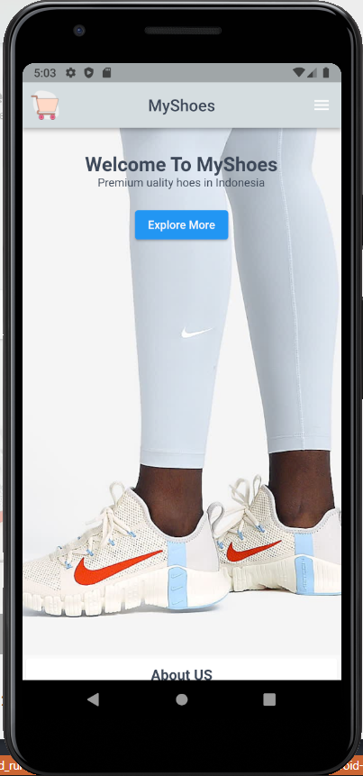
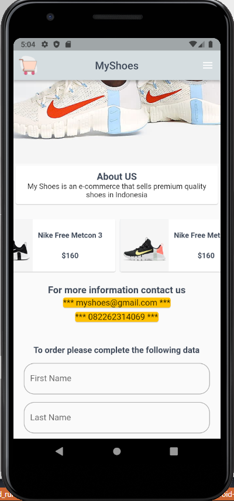
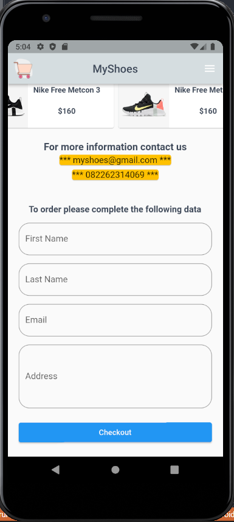
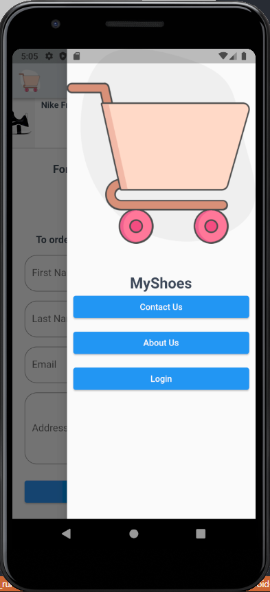
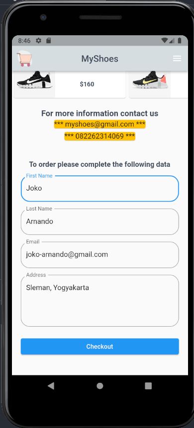
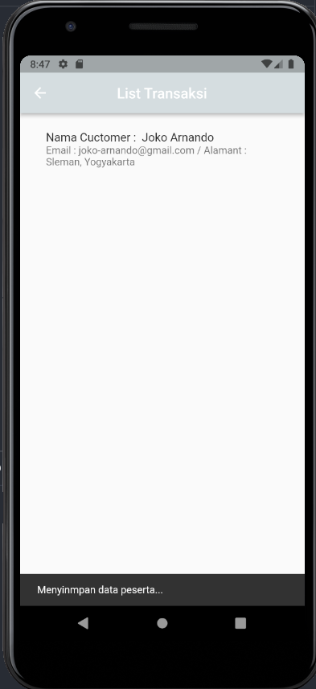

# Weekly3

## Data Diri

Nomor Urut : 1_023FLB_52
Nama : Ruslan

####Note
Pada project weekly task 3 ini saya mengambil dan memodifikasi dari weekly task 2 sehingga untuk struktur code nya kurang lebih sama namun ada beberapa update, saya akan menunjukan update dari code tersebut.

- Model (order.dart)

```import 'package:nanoid/non_secure.dart';

class ModelOrder {
  late String id;
  final String firstName;
  final String lastName;
  final String email;
  final String address;

  ModelOrder(
      {required this.firstName,
      required this.lastName,
      required this.email,
      required this.address}) {
    id = nanoid(3);
  }
}
```

Pada bagian model saya membuat model order dikarenakan pada task sebelumnya form saya adalah form order dengan field first name, last name, email dan adress.

- Provider (order_provider.dart)

```
import 'package:flutter/foundation.dart';
import 'package:task_weekly1/models/order.dart';

class OrderProvider with ChangeNotifier {
  final List<ModelOrder> _order = [];
  List<ModelOrder> get order => [..._order];

  void tambahOrder(ModelOrder newOrder) {
    _order.add(newOrder);
    notifyListeners();
  }
}

```

Pada bagian provider saya membuat class dengan nama OrderProvider dengan ChangeNotifier yang didalamnya berisi list kosong dengan nama \_order yang dimana list tersebut diambil dari model dan saya membuat getter dari \_order dengan nama order. dan juga saya membuat sebuah method tambahOrder.

- Item Order (item_order.dart)

```
class ItemOrder extends StatelessWidget {
  final ModelOrder order;
  const ItemOrder(this.order, {super.key});

  @override
  Widget build(BuildContext context) {
    return InkWell(
      child: ListTile(
        title: Text("Nama Cuctomer :  ${order.firstName} ${order.lastName}"),
        subtitle: Text("Email : ${order.email} / Alamant : ${order.address}"),
      ),
    );
  }
}
```

Pada item order saya membuat variabel order dengnan tipe ModelOrder dan mereturn inkwell dengan child listtile dengan titte first name dan last name dan pada bagian subtitle terdapat email dan alamat.

- Form (form.dart)

```
class FormPage extends StatefulWidget {
  const FormPage({super.key});

  @override
  State<FormPage> createState() => _FormPageState();
}

class _FormPageState extends State<FormPage> {
  final formKey = GlobalKey<FormState>();
  var dataOrder = {'firstName': '', 'lastName': '', 'email': '', 'address': ''};
  TextEditingController _controllerFirstName = TextEditingController();
  TextEditingController _controllerLastName = TextEditingController();
  TextEditingController _controlleremail = TextEditingController();
  TextEditingController _controllerAddress = TextEditingController();

  void _onSubmit() {
    formKey.currentState!.save();

    final orderbaru = ModelOrder(
      firstName: dataOrder['firstName']!,
      lastName: dataOrder['lastName']!,
      email: dataOrder['email']!,
      address: dataOrder['address']!,
    );

    Provider.of<OrderProvider>(context, listen: false).tambahOrder(orderbaru);
  }

  @override
  void dispose() {
    // TODO: implement dispose
    super.dispose();
    _controllerFirstName;
    _controllerLastName;
    _controlleremail;
    _controllerAddress;
  }

  @override
  Widget build(BuildContext context) {
    return Padding(
      padding: const EdgeInsets.all(20),
      child: Form(
        key: formKey,
        child: Column(
          mainAxisAlignment: MainAxisAlignment.center,
          children: [
            const Text(
              "To order please complete the following data",
              style: TextStyle(
                  fontSize: 16, fontWeight: FontWeight.bold, color: blackColor),
            ),
            const SizedBox(height: 15),
            TextFormField(
              controller: _controllerFirstName,
              keyboardType: TextInputType.text,
              decoration: const InputDecoration(
                label: Text("First Name"),
                hintText: "First Name",
                border: OutlineInputBorder(
                  borderRadius: BorderRadius.all(
                    Radius.circular(20),
                  ),
                ),
              ),
              validator: (value) {
                if (value == null || value.length < 2) {
                  return 'Silakan input nama yang valid';
                }
                return null;
              },
              onSaved: (newValue) {
                if (newValue != null) dataOrder['firstName'] = newValue;
              },
            ),
            const SizedBox(height: 15),
            TextFormField(
              controller: _controllerLastName,
              keyboardType: TextInputType.text,
              decoration: const InputDecoration(
                hintText: "Last Name",
                label: Text("Last Name"),
                border: OutlineInputBorder(
                  borderRadius: BorderRadius.all(
                    Radius.circular(20),
                  ),
                ),
              ),
              validator: (value) {
                if (value == null || value.length < 2) {
                  return 'Silakan input nama yang valid';
                }
                return null;
              },
              onSaved: (newValue) {
                if (newValue != null) dataOrder['lastName'] = newValue;
              },
            ),
            const SizedBox(height: 15),
            TextFormField(
              controller: _controlleremail,
              keyboardType: TextInputType.emailAddress,
              decoration: const InputDecoration(
                hintText: "Email",
                label: Text("Email"),
                border: OutlineInputBorder(
                  borderRadius: BorderRadius.all(
                    Radius.circular(20),
                  ),
                ),
              ),
              validator: (value) {
                if (value == null || value.length < 3) {
                  return 'Silakan input nama yang valid';
                }
                return null;
              },
              onSaved: (newValue) {
                if (newValue != null) dataOrder['email'] = newValue;
              },
            ),
            const SizedBox(height: 15),
            TextFormField(
              controller: _controllerAddress,
              keyboardType: TextInputType.multiline,
              maxLines: 4,
              decoration: const InputDecoration(
                label: Text("Address"),
                hintText: "Address",
                border: OutlineInputBorder(
                  borderRadius: BorderRadius.all(
                    Radius.circular(20),
                  ),
                ),
              ),
              validator: (value) {
                if (value == null || value.length < 2) {
                  return 'Silakan input nama yang valid';
                }
                return null;
              },
              onSaved: (newValue) {
                if (newValue != null) dataOrder['address'] = newValue;
              },
            ),
            Padding(
              padding: const EdgeInsets.only(bottom: 20, top: 20),
              child: SizedBox(
                width: double.infinity,
                child: ElevatedButton(
                  onPressed: () {
                    if (formKey.currentState != null &&
                        formKey.currentState!.validate()) {
                      _onSubmit();
                      ScaffoldMessenger.of(context).showSnackBar(
                        const SnackBar(
                          content: Text(
                            'Menyinmpan data peserta...',
                          ),
                        ),
                      );
                      Navigator.of(context).pushNamed(OrderPage.routeName);
                    }
                  },
                  child: const Text(
                    "Checkout",
                    style: TextStyle(color: whiteColor),
                  ),
                ),
              ),
            )
          ],
        ),
      ),
    );
  }
}

```

Pada bagian form masih sama seperti pada weekly task 2 namun saya menambahkan 4 buah controller dan 2 buah method, yang pertama adalah method onSubmit yang memanggil provider dari tambahOrder dan sebuah method dispose. dan pada bagian elevated button saya memanggil method onSubmit dan mengirimkan nya ke halaman order page.

- Order Page (order_page.dart)

```
class _OrderPageState extends State<OrderPage> {
  @override
  Widget build(BuildContext context) {
    final dataorder = Provider.of<OrderProvider>(context).order;
    return Scaffold(
      appBar: AppBar(
        title: const Text("List Transaksi"),
        centerTitle: true,
        backgroundColor: greyColor,
      ),
      body: Padding(
        padding: const EdgeInsets.all(20),
        child: ListView.separated(
          itemBuilder: ((context, index) {
            final order = dataorder.elementAt(index);
            return ItemOrder(order);
          }),
          separatorBuilder: (context, index) => const Divider(),
          itemCount: dataorder.length,
        ),
      ),
    );
  }
}
```

Pada halaman order page saya memanggil list dari order yang ada di provider yang saya masukan kedalam pvariabel dataorder dan saya mereturn listview.separated dengan mereturn itemOrder dari order.

- Hasil
  
  
  
  
  
  
